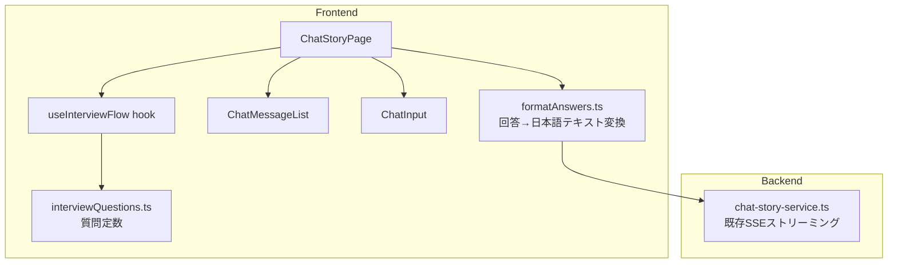
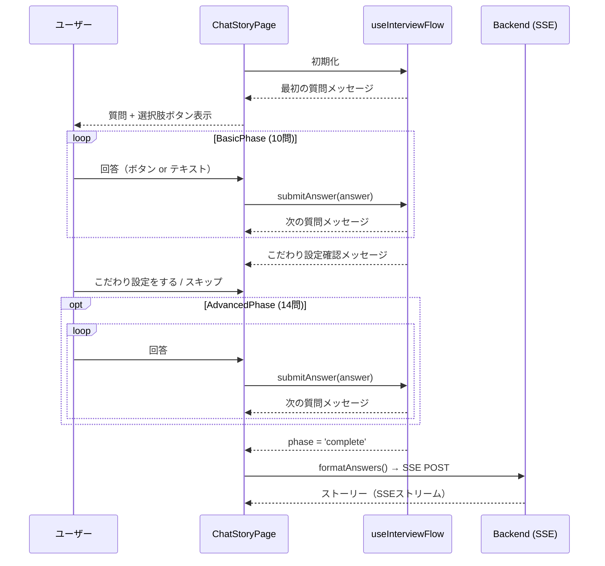
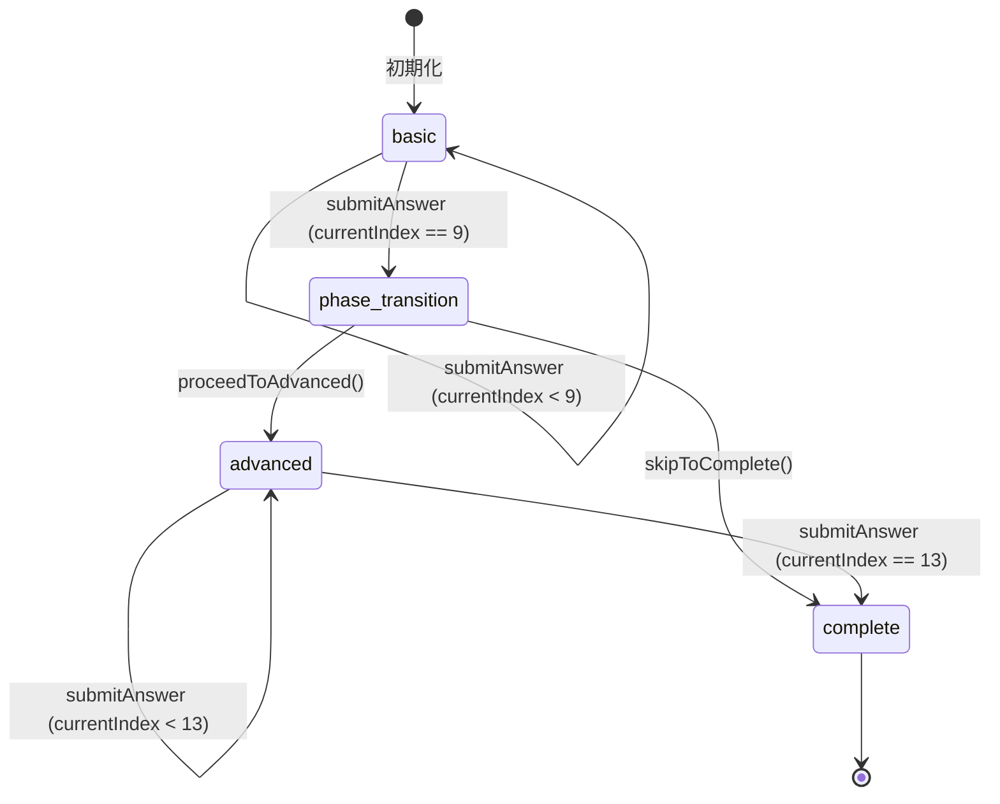

# Design Document: chat-story-interview-flow

## Overview

ChatStoryPage にインタビューフローを追加する。現在の ChatStoryPage は自由チャット形式で AI と会話しながらストーリーを作るが、ユーザーが何を入力すればよいか迷いやすい。本機能では、フロントエンド主導の構造化インタビューを先行させることで、ユーザーが選択肢ボタンをクリックするだけで絵本の要件を収集できるようにする。

インタビューは 2 フェーズ構成：
- **BasicPhase（かんたん作成）**: 必須 10 問
- **AdvancedPhase（こだわり設定）**: 任意 14 問

全回答完了後、収集した回答を人間が読みやすい日本語テキストに変換してバックエンドへ送信し、既存の SSE ストリーミング経路でストーリーを生成する。

### 設計方針

- インタビューフローはフロントエンド完結（バックエンドへの余分なリクエストなし）
- 質問データは定数ファイルとして定義（コード変更なしに管理可能）
- `useInterviewFlow` カスタムフックで状態管理を集約
- 既存の `ChatMessageList` の `[CHOICES: A|B|C]` 形式を複数選択に拡張
- インタビュー完了後は既存の自由チャットモードへシームレスに移行

---

## Architecture



### データフロー



---

## Components and Interfaces

### 1. `interviewQuestions.ts` （新規）

質問データを定数として定義するファイル。

```typescript
// packages/frontend/src/constants/interviewQuestions.ts

export interface InterviewQuestion {
  key: string;           // 回答を格納するキー
  text: string;          // 質問文
  choices: string[];     // 選択肢（空配列 = フリーテキストのみ）
  multiSelect?: boolean; // 複数選択可能か
}

export const BASIC_QUESTIONS: InterviewQuestion[] = [
  {
    key: 'targetAge',
    text: '何歳のお子さん向けに作りますか？',
    choices: ['0〜2歳', '3〜4歳', '5〜6歳', '7〜8歳'],
  },
  {
    key: 'readingStyle',
    text: 'どんな読み方をしますか？',
    choices: ['読み聞かせ（大人が読む）', '一緒に読む', '子どもが一人で読む'],
  },
  {
    key: 'length',
    text: '絵本の長さはどのくらいにしますか？',
    choices: ['短め（8ページ）', 'ふつう（12ページ）', '長め（16ページ）'],
  },
  {
    key: 'protagonist',
    text: '主人公はどんな子ですか？',
    choices: ['元気な男の子', '元気な女の子', '動物', 'その他'],
  },
  {
    key: 'personality',
    text: '主人公の性格は？',
    choices: ['好奇心旺盛', '優しい・思いやりがある', '勇気がある', 'のんびり屋', 'その他'],
  },
  {
    key: 'setting',
    text: 'お話の舞台はどこですか？',
    choices: ['森・自然', '街・公園', '海・川', '宇宙・空', '家・室内', 'その他'],
  },
  {
    key: 'theme',
    text: 'どんなテーマにしますか？',
    choices: ['冒険・探検', '友だちとの絆', '家族のあたたかさ', '成長・チャレンジ', '動物と仲良く', 'その他'],
  },
  {
    key: 'wish',
    text: '主人公はどんなことを願っていますか？',
    choices: ['友だちを作りたい', '何かを見つけたい', '困っている人を助けたい', '夢を叶えたい', 'その他'],
  },
  {
    key: 'obstacle',
    text: '主人公が困ることは何ですか？',
    choices: ['迷子になる', '怖いものに出会う', '大切なものをなくす', '友だちとケンカする', 'その他'],
  },
  {
    key: 'ending',
    text: 'どんな終わり方にしますか？',
    choices: ['ハッピーエンド（みんな笑顔）', '成長して終わる', '次の冒険へ続く感じ', 'その他'],
  },
];

export const ADVANCED_QUESTIONS: InterviewQuestion[] = [
  {
    key: 'characterCount',
    text: '登場人物は何人くらいにしますか？',
    choices: ['1人（主人公だけ）', '2〜3人', '4人以上'],
  },
  {
    key: 'atmosphere',
    text: '絵本の雰囲気は？',
    choices: ['明るく楽しい', 'ほのぼの・やさしい', 'ドキドキわくわく', 'しんみり・感動的'],
  },
  {
    key: 'realism',
    text: '現実感はどのくらい？',
    choices: ['リアルな日常', 'ちょっと不思議', 'ファンタジー全開'],
  },
  {
    key: 'storyPattern',
    text: '物語の型は？',
    choices: ['旅・冒険型', '問題解決型', '成長・変化型', '繰り返し型'],
  },
  {
    key: 'dialogueAmount',
    text: 'セリフの量は？',
    choices: ['少なめ（地の文中心）', 'ふつう', '多め（会話中心）'],
  },
  {
    key: 'repetition',
    text: '繰り返し表現を使いますか？',
    choices: ['使う（リズム感を出す）', '使わない'],
  },
  {
    key: 'onomatopoeia',
    text: 'オノマトペ（擬音語）を使いますか？',
    choices: ['たくさん使う', 'ほどほどに使う', 'あまり使わない'],
  },
  {
    key: 'motifs',
    text: '入れたいモチーフを選んでください（複数可）',
    choices: ['食べ物', '乗り物', '音楽', '魔法・ふしぎ', '動物', '自然・植物', 'スポーツ'],
    multiSelect: true,
  },
  {
    key: 'avoidElements',
    text: '避けたい要素を選んでください（複数可）',
    choices: ['怖い場面', '暗い雰囲気', '複雑な人間関係', '長いセリフ'],
    multiSelect: true,
  },
  {
    key: 'season',
    text: '季節は？',
    choices: ['春', '夏', '秋', '冬', '季節を問わない'],
  },
  {
    key: 'timeOfDay',
    text: '時間帯は？',
    choices: ['朝', '昼', '夕方', '夜', '特に決めない'],
  },
  {
    key: 'learningElement',
    text: '学び要素を入れますか？',
    choices: ['入れる（数・色・形など）', '入れる（思いやり・勇気など）', '入れない'],
  },
  {
    key: 'protagonistName',
    text: '主人公の名前はありますか？',
    choices: ['特に決めない'],
  },
  {
    key: 'languageLevel',
    text: '言葉のやさしさは？',
    choices: ['とてもやさしく（2〜3歳向け）', 'ふつう（4〜6歳向け）', 'すこし難しくてもOK（7歳以上）'],
  },
];

export const PHASE_TRANSITION_CHOICES = 'こだわり設定をする|スキップしてストーリーを作る';
```

### 2. `useInterviewFlow` カスタムフック（新規）

インタビューフローの状態管理と進行ロジックを担う React カスタムフック。

```typescript
// packages/frontend/src/hooks/useInterviewFlow.ts

export type InterviewPhase = 'basic' | 'advanced' | 'complete';

export interface InterviewState {
  phase: InterviewPhase;
  currentIndex: number;
  answers: Record<string, string>;
}

export interface UseInterviewFlowReturn {
  state: InterviewState;
  /** 現在表示すべき質問メッセージ（[CHOICES:...] 付き）を返す */
  getCurrentMessage: () => string;
  /** ユーザーの回答を受け取り、状態を更新して次のメッセージを返す */
  submitAnswer: (answer: string) => { nextMessage: string | null };
  /** こだわり設定フェーズへ進む */
  proceedToAdvanced: () => string;
  /** こだわり設定をスキップして完了へ */
  skipToComplete: () => void;
}
```

**状態遷移ロジック:**



### 3. `formatAnswers.ts` （新規）

`InterviewState.answers` を人間が読みやすい日本語テキストに変換するユーティリティ。

```typescript
// packages/frontend/src/utils/formatAnswers.ts

export function formatAnswersAsText(answers: Record<string, string>): string;
```

出力例：
```
【絵本の要件】
- 対象年齢: 3〜4歳
- 読み方: 読み聞かせ（大人が読む）
- 長さ: ふつう（12ページ）
...
```

### 4. `ChatMessageList` の拡張

既存の `[CHOICES: A|B|C]` パース処理を拡張し、`[MULTI_CHOICES: A|B|C]` 形式を追加サポートする。

```typescript
// 既存
function parseChoices(content: string): { text: string; choices: string[]; multiSelect: boolean }
```

- `[CHOICES: ...]` → 単一選択（既存動作）
- `[MULTI_CHOICES: ...]` → 複数選択トグル + 「決定する」ボタン

`ChatMessageListProps` に `multiSelectState` を追加：

```typescript
interface ChatMessageListProps {
  messages: ChatMessage[];
  onChoiceSelect?: (choice: string) => void;
  disabled?: boolean;
}
```

複数選択の選択状態は `ChatMessageList` 内部の `useState` で管理する（外部に漏らさない）。

### 5. `ChatStoryPage` の変更

- `useInterviewFlow` フックを組み込む
- セッション作成後、バックエンドへの挨拶メッセージ取得をスキップし、インタビューの最初の質問をローカルで生成
- `handleSend` をインタビューフェーズ中は `useInterviewFlow.submitAnswer` 経由に切り替え
- `phase === 'complete'` になったら `formatAnswers` でテキスト変換し、バックエンドへ送信
- 「ストーリーを完成させる」ボタンは `phase === 'complete'` のときのみ有効化

---

## Data Models

### `InterviewQuestion`

```typescript
interface InterviewQuestion {
  key: string;           // 回答格納キー（例: 'targetAge'）
  text: string;          // 質問文
  choices: string[];     // 選択肢リスト
  multiSelect?: boolean; // 複数選択フラグ（デフォルト: false）
}
```

### `InterviewState`

```typescript
interface InterviewState {
  phase: 'basic' | 'advanced' | 'complete';
  currentIndex: number;  // 現在のフェーズ内での質問インデックス
  answers: Record<string, string>; // { questionKey: answerText }
}
```

初期値:
```typescript
{ phase: 'basic', currentIndex: 0, answers: {} }
```

### `StoryRequirements`（送信用テキスト）

`formatAnswers` が生成する日本語テキスト文字列。既存の `ChatMessage` 型の `content` フィールドとして扱う。バックエンドへは既存の `/api/chat-stories/sessions/:id/messages` エンドポイントへ `{ message: formattedText }` として POST する。

### メッセージフォーマット規約

| フェーズ | メッセージ生成元 | `[CHOICES:]` 付与 |
|---------|--------------|-----------------|
| インタビュー中 | フロントエンド（`useInterviewFlow`） | あり |
| フェーズ移行確認 | フロントエンド | `[CHOICES: こだわり設定をする\|スキップしてストーリーを作る]` |
| インタビュー完了後 | バックエンド（GPT-4o SSE） | AIが判断 |

---


## Correctness Properties

*A property is a characteristic or behavior that should hold true across all valid executions of a system — essentially, a formal statement about what the system should do. Properties serve as the bridge between human-readable specifications and machine-verifiable correctness guarantees.*

### Property 1: 全質問が必須フィールドを持つ

*For any* question in BASIC_QUESTIONS or ADVANCED_QUESTIONS, the question object must have a non-empty `key` string, a non-empty `text` string, and a `choices` array (which may be empty).

**Validates: Requirements 1.3**

### Property 2: submitAnswer が回答を保存して次の質問へ進む

*For any* InterviewState in basic or advanced phase, and any non-empty answer string, calling `submitAnswer(answer)` must result in the answer being stored in `state.answers[currentQuestion.key]` and `currentIndex` incrementing by 1 (or phase transitioning if at the last question).

**Validates: Requirements 2.2, 5.2, 6.2**

### Property 3: BasicPhase の全質問が [CHOICES:] 形式を含む

*For any* question index in BasicPhase, `getCurrentMessage()` must return a string that ends with `[CHOICES: ...]` containing at least one choice option.

**Validates: Requirements 2.4**

### Property 4: 複数選択の決定ボタンがカンマ区切りで送信する

*For any* non-empty subset of choices selected in a `multiSelect` question, clicking the 「決定する」 button must call `onChoiceSelect` with a string that is the selected choices joined by `、` (Japanese comma), containing exactly the selected items.

**Validates: Requirements 4.3**

### Property 5: formatAnswers が全回答キーを含むテキストを返す

*For any* non-empty `answers` record, `formatAnswersAsText(answers)` must return a string that contains every key's corresponding answer value from the input record.

**Validates: Requirements 7.2**

---

## Error Handling

### フロントエンド

| エラー状況 | 対応 |
|-----------|------|
| `submitAnswer` に空文字列が渡される | 無視して状態を変更しない（ChatInput の既存バリデーションで防止） |
| `currentIndex` が質問数を超える | フェーズ移行ロジックで防止（境界チェック） |
| `formatAnswers` に空の answers が渡される | 空のテキストを返さず、デフォルトメッセージを含む文字列を返す |
| バックエンドへの送信失敗 | 既存の `setError` 経路でエラーメッセージを表示 |

### バックエンド

インタビューフロー完了後のバックエンド通信は既存の `sendMessage` 経路を使用するため、既存のエラーハンドリング（コンテンツフィルター、メッセージ数上限、SSE エラーイベント）がそのまま適用される。

---

## Testing Strategy

### デュアルテストアプローチ

ユニットテストとプロパティベーステストの両方を使用する。

**ユニットテスト（具体的な例・境界条件）**:
- `interviewQuestions.ts`: BasicPhase が 10 問、AdvancedPhase が 14 問であること（Requirements 1.1, 1.2）
- `interviewQuestions.ts`: `multiSelect: true` を持つ質問が `motifs` と `avoidElements` であること（Requirements 1.4）
- `useInterviewFlow`: 初期状態が `{ phase: 'basic', currentIndex: 0, answers: {} }` であること（Requirements 6.1）
- `useInterviewFlow`: BasicPhase 10 問完了後にフェーズ移行確認メッセージが返ること（Requirements 2.3）
- `useInterviewFlow`: フェーズ移行確認メッセージに `[CHOICES: こだわり設定をする|スキップしてストーリーを作る]` が含まれること（Requirements 3.4）
- `useInterviewFlow`: `proceedToAdvanced()` 後に phase が `'advanced'`、currentIndex が `0` になること（Requirements 3.1）
- `useInterviewFlow`: `skipToComplete()` 後に phase が `'complete'` になること（Requirements 3.2）
- `useInterviewFlow`: AdvancedPhase 14 問完了後に phase が `'complete'` になること（Requirements 3.3）
- `ChatMessageList`: `[MULTI_CHOICES: ...]` を含むメッセージで「決定する」ボタンが表示されること（Requirements 4.1）
- `ChatMessageList`: 何も選択していない状態で「決定する」ボタンが disabled であること（Requirements 4.4）

**プロパティベーステスト（普遍的な性質）**:

プロパティベーステストライブラリ: **fast-check**（TypeScript/JavaScript 向け）

各プロパティテストは最低 100 回のイテレーションで実行する。

```typescript
// タグ形式: Feature: chat-story-interview-flow, Property {N}: {property_text}
```

| Property | テスト内容 | fast-check アービトラリ |
|---------|-----------|----------------------|
| P1 | 全質問が必須フィールドを持つ | `fc.constantFrom(...allQuestions)` |
| P2 | submitAnswer が回答を保存して次へ進む | `fc.string({ minLength: 1 })` for answer |
| P3 | BasicPhase の全質問が [CHOICES:] を含む | `fc.integer({ min: 0, max: 9 })` for index |
| P4 | 複数選択の決定ボタンがカンマ区切りで送信する | `fc.subarray(choices, { minLength: 1 })` |
| P5 | formatAnswers が全回答キーを含むテキストを返す | `fc.dictionary(fc.string(), fc.string({ minLength: 1 }))` |

**テストファイル配置**:
- `packages/frontend/src/constants/__tests__/interviewQuestions.test.ts`
- `packages/frontend/src/hooks/__tests__/useInterviewFlow.test.ts`
- `packages/frontend/src/utils/__tests__/formatAnswers.test.ts`
- `packages/frontend/src/components/__tests__/ChatMessageList.multiselect.test.tsx`
