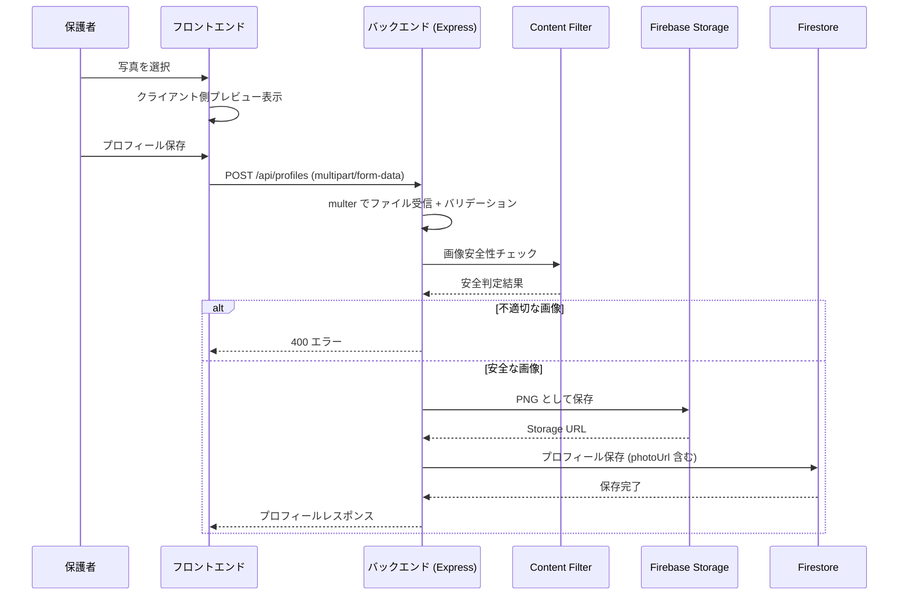
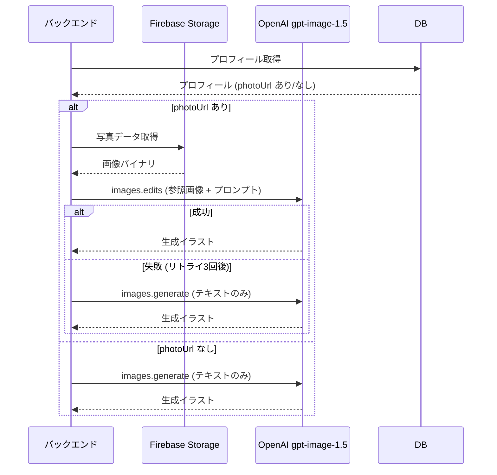

# 設計ドキュメント: 子供写真によるイラスト生成

## 概要

本機能は、既存の絵本生成アプリケーションに「子供の写真アップロード → 写真を参照したイラスト生成」の機能を追加する。親が子供の写真を1枚アップロードすると、gpt-image-1.5 の `/v1/images/edits` エンドポイントを使用して、その子供の外見的特徴を反映したイラストを生成する。写真が未登録の場合は、従来どおり `images.generate` エンドポイントでテキストプロンプトのみの生成にフォールバックする。

### 変更対象

| レイヤー | 変更内容 |
|---|---|
| バックエンド | `illustration-engine.ts` を拡張し `images.edits` 対応、写真アップロード用ルート・サービス追加、`profile-service.ts` に `photoUrl` フィールド追加 |
| フロントエンド | `ProfileFormPage.tsx` に写真アップロードUI追加 |
| 共有型定義 | `schemas.ts` にアップロードバリデーション定数追加、`types.ts` に型追加 |

### 設計判断

1. **`images.edits` エンドポイント採用**: gpt-image-1.5 は `/v1/images/edits` で入力画像を参照画像として受け取れる。写真をそのまま参照画像として渡し、プロンプトで「絵本スタイルのキャラクターとして描く」と指示することで、子供の外見的特徴を反映したイラストを生成する。
2. **multer によるファイルアップロード**: Express + multer でメモリストレージを使用し、バリデーション後に Firebase Storage へ保存する。ディスクI/Oを避けてCloud Run環境に適合させる。
3. **PNG 統一保存**: アップロードされた画像は形式に関わらず Firebase Storage に PNG として保存する。gpt-image-1.5 が PNG/WebP/JPG を受け付けるため、元の形式のまま保存しても問題ないが、統一性のため PNG に変換する。
4. **フォールバック戦略**: `images.edits` が失敗した場合、`images.generate` にフォールバックすることで、写真参照が使えない場合でも絵本生成を完了できる。

## アーキテクチャ

### 写真アップロードフロー



### 写真参照イラスト生成フロー



## コンポーネントとインターフェース

### 新規・変更バックエンドサービス

#### PhotoUploadService (新規)

写真のバリデーション、安全性チェック、Firebase Storage への保存を担当する。

```typescript
// packages/backend/src/services/photo-upload-service.ts

export interface PhotoValidationResult {
  valid: boolean;
  error?: string;
}

export interface PhotoUploadResult {
  photoUrl: string;
  storagePath: string;
}

/** ファイル形式・サイズのバリデーション */
export function validatePhoto(
  file: { mimetype: string; size: number }
): PhotoValidationResult;

/** 写真を Firebase Storage にアップロード */
export async function uploadPhoto(
  userId: string,
  profileId: string,
  fileBuffer: Buffer,
  options?: { storageBucket?: StorageBucket }
): Promise<PhotoUploadResult>;

/** Firebase Storage から写真を削除 */
export async function deletePhoto(
  userId: string,
  profileId: string,
  options?: { storageBucket?: StorageBucket }
): Promise<void>;

/** Firebase Storage から写真のバイナリを取得 */
export async function downloadPhoto(
  storagePath: string,
  options?: { storageBucket?: StorageBucket }
): Promise<Buffer>;
```

#### IllustrationEngine (変更)

既存の `generateForPage` を拡張し、`photoUrl` がある場合は `images.edits` を使用する。

```typescript
// packages/backend/src/services/illustration-engine.ts (変更)

export async function generateForPage(
  page: { pageNumber: number; text: string },
  profile: ChildProfile,
  theme: Theme,
  options: {
    userId: string;
    bookId: string;
    photoStoragePath?: string | null; // 新規追加: 写真の Storage パス
    openaiClient?: OpenAI;
    storageBucket?: StorageBucket;
  }
): Promise<IllustrationResult>;

/** images.edits を使用した写真参照イラスト生成 (新規内部関数) */
function generateWithPhoto(
  client: OpenAI,
  prompt: string,
  photoBuffer: Buffer,
  size: string
): Promise<string>; // base64 encoded image

/** 写真参照用プロンプト構築 (新規) */
function buildPhotoReferencePrompt(
  page: { pageNumber: number; text: string },
  profile: ChildProfile,
  theme: Theme
): string;
```

#### ProfileService (変更)

`ChildProfileDoc` に `photoUrl` と `photoStoragePath` フィールドを追加する。

```typescript
// packages/backend/src/services/profile-service.ts (変更)

export interface ChildProfileDoc {
  // ... 既存フィールド
  photoUrl: string | null;         // 新規: 写真の公開URL
  photoStoragePath: string | null;  // 新規: Storage 内パス
}
```

### 新規・変更 API エンドポイント

#### プロフィール作成 (変更)

既存の `POST /api/profiles` を `multipart/form-data` 対応に変更する。

```typescript
// POST /api/profiles
// Content-Type: multipart/form-data
// フィールド:
//   - name: string (必須)
//   - age: number (必須)
//   - gender?: string
//   - favoriteColor?: string
//   - favoriteAnimal?: string
//   - appearance?: string
//   - photo?: File (任意, JPEG/PNG/WebP, 10MB以下)
```

#### 写真管理エンドポイント (新規)

```typescript
// PUT /api/profiles/:id/photo
// Content-Type: multipart/form-data
// フィールド: photo: File (必須)
// レスポンス: { photoUrl: string }

// DELETE /api/profiles/:id/photo
// レスポンス: 204 No Content
```

### フロントエンド変更

#### ProfileFormPage (変更)

既存のプロフィール作成フォームに写真アップロード領域を追加する。

```typescript
// 追加する状態
const [photoFile, setPhotoFile] = useState<File | null>(null);
const [photoPreview, setPhotoPreview] = useState<string | null>(null);
const [uploading, setUploading] = useState(false);

// FormData で送信するように変更
async function handleSubmit(e: FormEvent) {
  const formData = new FormData();
  formData.append('name', name.trim());
  formData.append('age', String(age));
  // ... 他のフィールド
  if (photoFile) {
    formData.append('photo', photoFile);
  }
  // apiClient を使わず直接 fetch で multipart 送信
}
```

#### PhotoUploadArea コンポーネント (新規)

```typescript
// packages/frontend/src/components/PhotoUploadArea.tsx

interface PhotoUploadAreaProps {
  photoPreview: string | null;
  onFileSelect: (file: File) => void;
  onRemove: () => void;
  uploading: boolean;
  error?: string;
}

export function PhotoUploadArea(props: PhotoUploadAreaProps): JSX.Element;
```

### API クライアント変更

`apiClient` に `multipart/form-data` 送信用メソッドを追加する。

```typescript
// packages/frontend/src/api/client.ts (追加)
export const apiClient = {
  // ... 既存メソッド
  postFormData<T>(path: string, formData: FormData): Promise<T>;
};
```

## データモデル

### Firestore ドキュメント変更

#### childProfiles/{profileId} (変更)

```
users/{userId}/childProfiles/{profileId}
├── name: string
├── age: number
├── gender: string | null
├── favoriteColor: string | null
├── favoriteAnimal: string | null
├── appearance: string | null
├── photoUrl: string | null          ← 新規
├── photoStoragePath: string | null   ← 新規
├── createdAt: Timestamp
└── updatedAt: Timestamp
```

### Firebase Storage パス変更

```
gs://{bucket}/
├── users/{userId}/
│   ├── profiles/{profileId}/
│   │   └── photo.png                ← 新規: アップロード写真
│   └── books/{bookId}/
│       ├── illustrations/
│       │   ├── page-1.png
│       │   └── ...
│       └── output.pdf
```

### バリデーション定数

```typescript
// packages/shared/src/constants.ts (追加)
export const PHOTO_MAX_SIZE_BYTES = 10 * 1024 * 1024; // 10MB
export const PHOTO_ALLOWED_MIME_TYPES = [
  'image/jpeg',
  'image/png',
  'image/webp',
] as const;
```

### Zod スキーマ変更

```typescript
// packages/shared/src/schemas.ts (追加)
export const PhotoUploadSchema = z.object({
  mimetype: z.enum(['image/jpeg', 'image/png', 'image/webp']),
  size: z.number().max(10 * 1024 * 1024),
});
```


## 正確性プロパティ

*プロパティとは、システムの全ての有効な実行において真であるべき特性や振る舞いのことである。プロパティは、人間が読める仕様と機械が検証可能な正確性保証の橋渡しとなる。*

### Property 1: 写真バリデーションの正確性

*任意の*ファイルに対して、MIME タイプが `image/jpeg`、`image/png`、`image/webp` のいずれかであり、かつサイズが 10MB 以下である場合にのみバリデーションが成功する。それ以外のファイルはすべて拒否される。

**Validates: Requirements 1.1, 1.2, 1.3, 1.4**

### Property 2: 写真アップロードラウンドトリップ

*任意の*有効な写真ファイルに対して、アップロード後に Firebase Storage の `users/{userId}/profiles/{profileId}/photo.png` パスにファイルが存在し、かつプロフィールドキュメントの `photoUrl` フィールドに非null の URL が記録されている。

**Validates: Requirements 1.5, 1.6**

### Property 3: 写真なしプロフィール作成

*任意の*有効なプロフィールデータ（写真なし）に対して、プロフィール作成が成功し、`photoUrl` は null である。

**Validates: Requirements 2.4**

### Property 4: 写真有無による API エンドポイント選択

*任意の*プロフィールとページに対して、`photoStoragePath` が存在する場合は `images.edits` エンドポイントが呼ばれ、存在しない場合は `images.generate` エンドポイントが呼ばれる。

**Validates: Requirements 3.1, 3.2**

### Property 5: 写真参照プロンプトの内容

*任意の*プロフィール（写真あり）とテーマの組み合わせに対して、`buildPhotoReferencePrompt` が生成するプロンプトには「参照画像の子供の外見的特徴を反映」に相当する指示文が含まれる。

**Validates: Requirements 3.3**

### Property 6: 全ページで同一参照画像の使用

*任意の*N ページの絵本生成において、写真付きプロフィールの場合、全 N 回の `images.edits` 呼び出しに同一の写真バッファが渡される。

**Validates: Requirements 3.4**

### Property 7: 不適切画像の拒否と非保存

*任意の*アップロードされた画像に対して、コンテンツフィルターが不適切と判定した場合、画像は Firebase Storage に保存されず、エラーレスポンスが返される。

**Validates: Requirements 4.1, 4.2**

### Property 8: 写真差し替え時の旧写真削除

*任意の*プロフィール（既存写真あり）に対して、新しい写真をアップロードすると、旧写真が Firebase Storage から削除され、新しい写真のみが存在する。

**Validates: Requirements 5.1**

### Property 9: 写真削除ラウンドトリップ

*任意の*プロフィール（写真あり）に対して、写真を削除すると Firebase Storage から写真ファイルが削除され、プロフィールドキュメントの `photoUrl` と `photoStoragePath` が null になる。

**Validates: Requirements 5.2**

### Property 10: プロフィール削除時の写真カスケード削除

*任意の*プロフィール（写真あり）に対して、プロフィールを削除すると、関連する写真も Firebase Storage から削除される。

**Validates: Requirements 5.3**

## エラーハンドリング

### 写真アップロード関連エラー

| エラー条件 | HTTP ステータス | エラーコード | メッセージ |
|---|---|---|---|
| 非対応ファイル形式 | 400 | `INVALID_FILE_TYPE` | 対応していないファイル形式です。JPEG、PNG、WebP のいずれかをアップロードしてください |
| ファイルサイズ超過 | 400 | `FILE_TOO_LARGE` | ファイルサイズが大きすぎます。10MB以下の画像をアップロードしてください |
| コンテンツ安全性違反 | 400 | `CONTENT_UNSAFE` | アップロードされた画像は使用できません。別の画像をお試しください |
| Storage 保存失敗 | 500 | `UPLOAD_ERROR` | 写真のアップロードに失敗しました。再試行してください |
| 写真データ取得失敗 | 500 | `PHOTO_FETCH_ERROR` | 写真データの取得に失敗しました |

### イラスト生成関連エラー

| エラー条件 | 対応方針 |
|---|---|
| `images.edits` 失敗 | 指数バックオフ（1秒、2秒、4秒）で最大3回リトライ |
| リトライ後も `images.edits` 失敗 | `images.generate` にフォールバック（テキストプロンプトのみ） |
| フォールバックも失敗 | 既存のエラーハンドリング（`IllustrationEngineError`）に従う |

### リトライ戦略

```typescript
// images.edits のリトライ + フォールバック
const RETRY_DELAYS = [1000, 2000, 4000];

for (let attempt = 0; attempt <= RETRY_DELAYS.length; attempt++) {
  try {
    return await generateWithPhoto(client, prompt, photoBuffer, size);
  } catch (error) {
    if (attempt < RETRY_DELAYS.length) {
      await sleep(RETRY_DELAYS[attempt]);
    }
  }
}
// フォールバック: images.generate
return await generateWithTextOnly(client, prompt, size);
```

## テスト戦略

### テストフレームワーク

- **ユニットテスト / プロパティベーステスト**: Vitest + fast-check
- プロパティベーステストライブラリとして **fast-check** を使用（既存プロジェクトで採用済み）

### デュアルテストアプローチ

- **ユニットテスト**: 特定の例、エッジケース、エラー条件の検証
- **プロパティベーステスト**: 全ての入力に対して成立すべき普遍的なプロパティの検証

### プロパティベーステスト設定

- 各プロパティテストは最低 **100 イテレーション** を実行する
- 各テストには設計ドキュメントのプロパティへの参照コメントを付与する
- タグ形式: **Feature: child-photo-illustration, Property {number}: {property_text}**
- 各正確性プロパティは **1つのプロパティベーステスト** で実装する

### テスト対象と方針

| テスト対象 | テスト種別 | 対応プロパティ |
|---|---|---|
| `validatePhoto` | プロパティテスト | Property 1: 写真バリデーション |
| `uploadPhoto` + `getProfileById` | プロパティテスト | Property 2: アップロードラウンドトリップ |
| `createProfile` (写真なし) | プロパティテスト | Property 3: 写真なしプロフィール |
| `generateForPage` (分岐) | プロパティテスト | Property 4: API エンドポイント選択 |
| `buildPhotoReferencePrompt` | プロパティテスト | Property 5: プロンプト内容 |
| `generateForPage` (複数ページ) | プロパティテスト | Property 6: 同一参照画像 |
| `uploadPhoto` + Content Filter | プロパティテスト | Property 7: 不適切画像拒否 |
| `uploadPhoto` (差し替え) | プロパティテスト | Property 8: 写真差し替え |
| `deletePhoto` + `getProfileById` | プロパティテスト | Property 9: 写真削除ラウンドトリップ |
| `deleteProfile` | プロパティテスト | Property 10: カスケード削除 |
| `images.edits` リトライ | ユニットテスト | Requirements 3.5: リトライ動作 |
| `images.edits` フォールバック | ユニットテスト | Requirements 3.6: フォールバック動作 |
| 写真プレビュー表示 | ユニットテスト | Requirements 2.2: UI プレビュー |
| 削除ボタン表示 | ユニットテスト | Requirements 2.3: UI 削除ボタン |
| アップロードインジケーター | ユニットテスト | Requirements 2.5: UI インジケーター |
| 認証チェック | ユニットテスト | Requirements 5.4: 認証済みユーザーのみ |

### テストファイル構成

```
packages/backend/src/services/__tests__/
├── photo-upload-service.test.ts          # Property 1, 2, 3, 7, 8, 9, 10
├── illustration-engine-photo.test.ts     # Property 4, 5, 6 + リトライ/フォールバック

packages/frontend/src/components/__tests__/
├── PhotoUploadArea.test.tsx              # UI ユニットテスト
```
