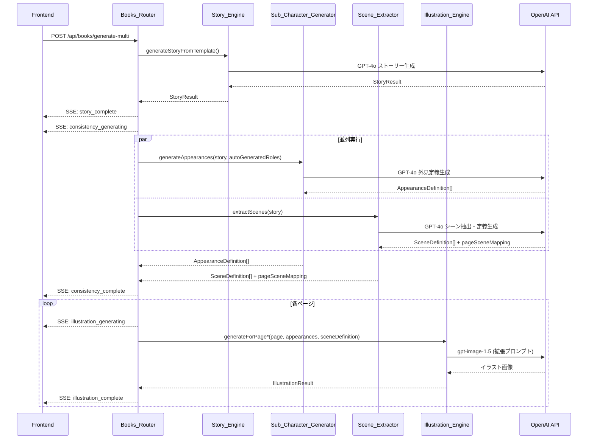
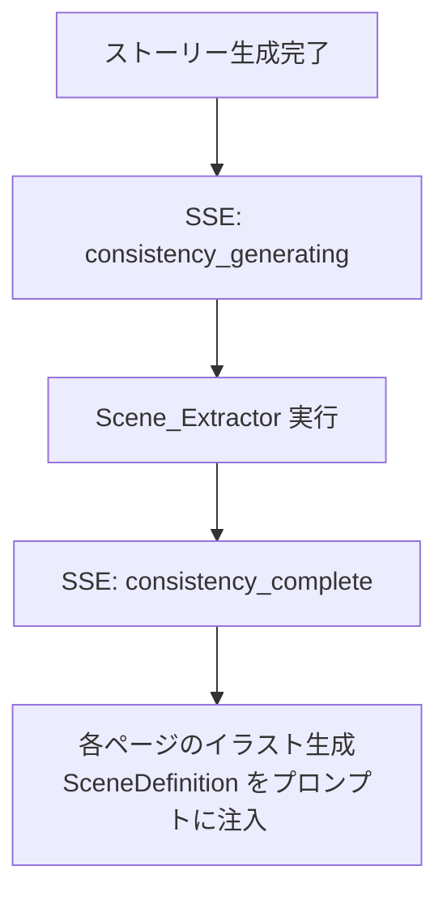
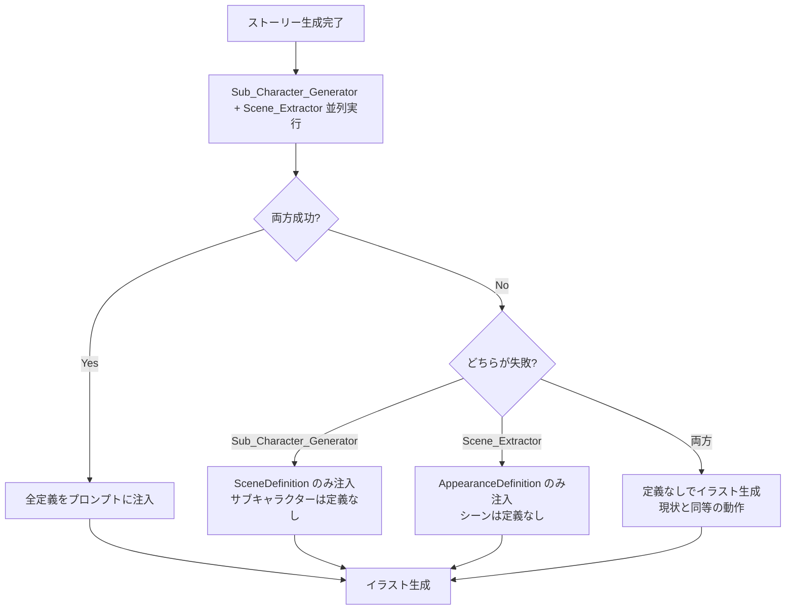

# イラスト一貫性向上 設計書

## 概要

本設計書は、絵本生成時にユーザーが事前登録していないサブキャラクター（友達、先生、動物など）やシーン（場所・背景）がページごとに異なる外見・描写で生成される問題を解決するための技術設計を定義する。

### 解決するコア課題

現在のシステムでは、`Registered_Character`（写真・キャラクターシート付き）は参照画像によりページ間で一貫した外見を維持できるが、以下の2つのケースで一貫性が欠如している:

1. **サブキャラクター**: テンプレートで `auto_generated` タイプとして定義されるキャラクター（友達、先生など）は、各ページのイラスト生成時に独立したプロンプトで描画されるため、外見がページごとに変わる
2. **シーン（場所・背景）**: 同じ場所（例: 公園、教室）が複数ページに登場する場合、背景の詳細（家具の配置、色調、植物など）がページごとに異なる

### アプローチ

ストーリー生成完了後、イラスト生成開始前に以下の2つの処理を挿入する:

1. **Sub_Character_Generator**: GPT-4o を使い、ストーリーテキストに基づいて `auto_generated` キャラクターの詳細な外見定義（`AppearanceDefinition`）を英語で生成
2. **Scene_Extractor**: GPT-4o を使い、ストーリーテキストから各ページのシーンを識別し、ユニークなシーン定義（`SceneDefinition`）を英語で生成

生成された定義をイラスト生成プロンプトに注入することで、全ページで視覚的一貫性を確保する。

### 設計方針

- **既存フローの拡張**: `books.ts` の generate / generate-multi フローにステップを追加。既存のイラスト生成ロジックは変更しない
- **Graceful Degradation**: Sub_Character_Generator / Scene_Extractor が失敗しても、定義なしでイラスト生成を続行（現状と同等の動作）
- **並列実行**: サブキャラクター定義生成とシーン抽出は並列に実行し、レイテンシを最小化
- **既存の型・スキーマの拡張**: `packages/shared` の型定義とスキーマに新しいフィールドを追加

## アーキテクチャ

### 処理フロー（generate-multi の場合）



### 処理フロー（generate の場合）

シングルキャラクターフローでは Sub_Character_Generator は不要（サブキャラクターのロール定義がないため）。Scene_Extractor のみ実行する。



### モジュール構成

```
packages/backend/src/services/
  ├── sub-character-generator.ts   # 新規: サブキャラクター外見定義生成
  ├── scene-extractor.ts           # 新規: シーン抽出・定義生成
  ├── illustration-engine.ts       # 拡張: プロンプトに定義注入
  └── ...

packages/shared/src/
  ├── types.ts                     # 拡張: AppearanceDefinition, SceneDefinition, SSE イベント
  └── schemas.ts                   # 拡張: characterType バリデーション
```

## コンポーネントとインターフェース

### Sub_Character_Generator (`sub-character-generator.ts`)

ストーリーテキストと `auto_generated` ロール一覧を受け取り、各ロールの外見定義を GPT-4o で生成する。

```typescript
import OpenAI from 'openai';
import type { AppearanceDefinition } from '@picture-book/shared';
import type { StoryResult } from './story-engine.js';

export interface GenerateAppearancesInput {
  story: StoryResult;
  autoGeneratedRoles: { role: string; label: string }[];
}

export interface GenerateAppearancesResult {
  appearances: Map<string, AppearanceDefinition>;
}

/**
 * auto_generated ロールの外見定義を GPT-4o で生成する。
 * ストーリーテキスト内のキャラクター描写と矛盾しない定義を生成する。
 */
export async function generateAppearances(
  input: GenerateAppearancesInput,
  openaiClient?: OpenAI
): Promise<GenerateAppearancesResult>;
```

GPT-4o へのプロンプト構成:
- ストーリー全文を入力として渡す
- 各 `auto_generated` ロールの名前・ラベルを指定
- JSON 形式で `AppearanceDefinition` の各フィールドを出力させる
- `response_format: { type: 'json_object' }` を使用

### Scene_Extractor (`scene-extractor.ts`)

ストーリーテキストを受け取り、ユニークなシーンを識別して定義を生成し、各ページへのマッピングを返す。

```typescript
import OpenAI from 'openai';
import type { SceneDefinition } from '@picture-book/shared';
import type { StoryResult } from './story-engine.js';

export interface ExtractScenesInput {
  story: StoryResult;
}

export interface ExtractScenesResult {
  scenes: SceneDefinition[];
  pageSceneMapping: Record<number, string>; // pageNumber -> sceneId
}

/**
 * ストーリーテキストからシーンを抽出し、定義を生成する。
 * 同一の場所が複数ページに登場する場合、同一の SceneDefinition を共有する。
 */
export async function extractScenes(
  input: ExtractScenesInput,
  openaiClient?: OpenAI
): Promise<ExtractScenesResult>;
```

GPT-4o へのプロンプト構成:
- ストーリー全文（ページ番号付き）を入力として渡す
- 各ページのシーン（場所）を識別し、同一場所には同一IDを付与
- 各ユニークシーンの `SceneDefinition` を英語で出力
- 各ページに対応するシーンIDのマッピングを出力
- `response_format: { type: 'json_object' }` を使用

### Illustration_Engine 拡張

既存の `buildPhotoReferencePrompt` と `buildMultiCharacterPrompt` を拡張し、`AppearanceDefinition` と `SceneDefinition` をプロンプトに注入する。

```typescript
// generateForPage の options に追加
export interface GenerateForPageOptions {
  // ... 既存フィールド ...
  sceneDefinition?: SceneDefinition;  // 新規: シーン定義
}

// generateForPageMultiCharacter の options に追加
export interface GenerateForPageMultiCharacterOptions {
  // ... 既存フィールド ...
  autoGeneratedAppearances?: Map<string, AppearanceDefinition>;  // 新規: サブキャラクター外見定義
  sceneDefinition?: SceneDefinition;  // 新規: シーン定義
}
```

プロンプト注入の構成:

```
[既存のプロンプト内容]

AUTO-GENERATED CHARACTER APPEARANCES:
[friend] Tanaka-kun: short black hair, round face, brown eyes, ...
[teacher] Yamada-sensei: tall adult, glasses, neat short hair, ...

SCENE DEFINITION (MUST match across all pages showing this location):
Location: School playground
Key elements: large oak tree in the corner, red climbing frame, ...
Color palette: warm yellows and greens
Lighting: bright afternoon sunlight
Atmosphere: lively and cheerful
```

### Template_Service 拡張

`TemplateRole` に `characterType` フィールドを追加する。

```typescript
// 拡張された TemplateRole
export interface TemplateRole {
  role: string;
  label: string;
  required: boolean;
  characterType?: 'registered' | 'auto_generated';  // 新規、デフォルト: 'registered'
}
```

### Books_Router 拡張

`generate-multi` と `generate` の両フローに、ストーリー生成後・イラスト生成前のステップを追加する。

generate-multi フロー:
1. ストーリー生成 → コンテンツチェック
2. **SSE: consistency_generating**
3. **auto_generated ロールの抽出 → Sub_Character_Generator + Scene_Extractor を並列実行**
4. **SSE: consistency_complete**
5. キャラクターシート確認 → イラスト生成（拡張プロンプト使用）

generate フロー:
1. ストーリー生成 → コンテンツチェック
2. **SSE: consistency_generating**
3. **Scene_Extractor 実行**
4. **SSE: consistency_complete**
5. 外見分析 → キャラクターシート → イラスト生成（拡張プロンプト使用）


## データモデル

### 新規型定義 (`packages/shared/src/types.ts` に追加)

#### AppearanceDefinition

サブキャラクターの外見を記述する構造化データ。イラスト生成モデルが解釈しやすい英語で記述される。

```typescript
export interface AppearanceDefinition {
  role: string;              // ロール識別子 (例: "friend", "teacher")
  name: string;              // キャラクター名 (例: "Tanaka-kun")
  hairStyle: string;         // 髪型 (例: "short spiky hair with side parting")
  hairColor: string;         // 髪色 (例: "dark brown")
  clothing: string;          // 服装 (例: "yellow T-shirt, green shorts, white sneakers")
  bodyType: string;          // 体型 (例: "small child, slim build")
  ageGroup: string;          // 年齢層 (例: "5-6 years old child")
  distinguishingFeatures: string;  // 特徴的な外見要素 (例: "round glasses, freckles on cheeks")
}
```

#### SceneDefinition

シーンの背景描写を記述する構造化データ。

```typescript
export interface SceneDefinition {
  sceneId: string;           // シーン識別子 (例: "school_playground")
  locationName: string;      // 場所名 (例: "School playground")
  keyElements: string;       // 主要な構成要素 (例: "large oak tree, red climbing frame, sandbox")
  colorPalette: string;      // 色調 (例: "warm yellows and greens")
  lighting: string;          // 照明 (例: "bright afternoon sunlight")
  atmosphere: string;        // 雰囲気 (例: "lively and cheerful")
}
```

#### TemplateRole 拡張

```typescript
export interface TemplateRole {
  role: string;
  label: string;
  required: boolean;
  characterType?: 'registered' | 'auto_generated';  // 新規フィールド
}
```

#### SSE イベント拡張

```typescript
// ProgressEvent に追加
| { type: 'consistency_generating' }
| { type: 'consistency_complete' }

// MultiProgressEvent に追加
| { type: 'consistency_generating' }
| { type: 'consistency_complete' }
```

#### ページシーンマッピング

```typescript
// pageNumber から sceneId への対応
export type PageSceneMapping = Record<number, string>;
```

### スキーマ拡張 (`packages/shared/src/schemas.ts`)

#### CharacterType バリデーション

```typescript
export const CharacterTypeSchema = z.enum(['registered', 'auto_generated']);
```

#### CreateTemplateSchema 拡張

```typescript
export const CreateTemplateSchema = z.object({
  // ... 既存フィールド ...
  roles: z.array(z.object({
    role: z.string().min(1),
    label: z.string().min(1),
    required: z.boolean(),
    characterType: CharacterTypeSchema.optional().default('registered'),  // 新規
  })).min(1),
  // ... 既存フィールド ...
});
```

### GPT-4o プロンプト設計

#### Sub_Character_Generator プロンプト

```
You are a character designer for a children's picture book.
Based on the story text below, generate detailed appearance definitions for the following auto-generated characters.

STORY:
Page 1: "{page1_text}"
Page 2: "{page2_text}"
...

CHARACTERS TO DEFINE:
- [friend] たなかくん (friend role)
- [teacher] やまだせんせい (teacher role)

For each character, provide:
- hairStyle: detailed hair description
- hairColor: specific color
- clothing: full outfit description (top, bottom, shoes)
- bodyType: build and height relative to age
- ageGroup: approximate age range
- distinguishingFeatures: unique visual features

IMPORTANT:
- Descriptions must be in English
- Must be consistent with any character descriptions in the story text
- Must be specific enough for an illustrator to draw the same character consistently
- Use warm, friendly, picture-book-appropriate descriptions

Output as JSON:
{
  "appearances": [
    {
      "role": "friend",
      "name": "Tanaka-kun",
      "hairStyle": "...",
      "hairColor": "...",
      "clothing": "...",
      "bodyType": "...",
      "ageGroup": "...",
      "distinguishingFeatures": "..."
    }
  ]
}
```

#### Scene_Extractor プロンプト

```
You are a background artist for a children's picture book.
Analyze the story below and identify all unique locations/scenes.
For pages that share the same location, assign the same scene ID.

STORY:
Page 1: "{page1_text}"
Page 2: "{page2_text}"
...

For each unique scene, provide:
- sceneId: a short snake_case identifier
- locationName: descriptive name in English
- keyElements: specific objects, furniture, plants, buildings
- colorPalette: dominant colors for this scene
- lighting: lighting conditions
- atmosphere: mood and feeling

Also provide a mapping of each page number to its scene ID.

IMPORTANT:
- If the same location appears on multiple pages, use the SAME sceneId
- Descriptions must be in English
- Be specific enough for an illustrator to draw the same background consistently
- Keep settings realistic and everyday (no fantasy elements unless the story requires it)

Output as JSON:
{
  "scenes": [
    {
      "sceneId": "school_playground",
      "locationName": "School playground",
      "keyElements": "...",
      "colorPalette": "...",
      "lighting": "...",
      "atmosphere": "..."
    }
  ],
  "pageSceneMapping": {
    "1": "school_playground",
    "2": "classroom",
    "3": "school_playground"
  }
}
```

### Firestore への永続化

AppearanceDefinition と SceneDefinition は Firestore に永続化しない。これらはイラスト生成時にのみ使用される一時的なデータであり、生成フローのメモリ内で保持される。再生成時には再度 GPT-4o で生成する。

### 既存データとの互換性

- `TemplateRole` の `characterType` フィールドはオプショナル。既存テンプレートでは `undefined` となり、デフォルト値 `'registered'` として扱われる
- 既存の `generate` / `generate-multi` フローは、Scene_Extractor が失敗しても現状と同等の動作を維持する
- `ProgressEvent` / `MultiProgressEvent` の新しいイベントタイプは、既存のフロントエンドコードでは無視される（unknown イベントは処理しない設計）

## Correctness Properties

*プロパティとは、システムのすべての有効な実行において真であるべき特性や振る舞いのことである。プロパティは、人間が読める仕様と機械が検証可能な正当性保証の橋渡しとなる。*

### Property 1: characterType のラウンドトリップとデフォルト値

*For any* TemplateRole に対して、`characterType` を `"registered"` または `"auto_generated"` として指定してテンプレートを作成し再取得した場合、指定した値が保持されること。また、`characterType` を指定せずに作成した場合、デフォルト値 `"registered"` として扱われること。

**Validates: Requirements 1.1, 1.4**

### Property 2: characterType に基づくキャラクター割り当て要否

*For any* テンプレートとキャラクター割り当てマップに対して、`characterType` が `"registered"` の必須ロールにキャラクターが割り当てられていない場合はバリデーションエラーとなり、`characterType` が `"auto_generated"` のロールにキャラクターが割り当てられていなくてもバリデーションが成功すること。

**Validates: Requirements 1.2, 1.3**

### Property 3: characterType バリデーション

*For any* 文字列に対して、`"registered"` または `"auto_generated"` 以外の値を `characterType` として指定した場合、`CreateTemplateSchema` のバリデーションが拒否すること。

**Validates: Requirements 1.5, 5.4**

### Property 4: サブキャラクター外見定義の完全性

*For any* ストーリーテキストと `auto_generated` ロールのリストに対して、`generateAppearances` が各ロールに対応する `AppearanceDefinition` を返し、各定義の `hairStyle`、`hairColor`、`clothing`、`bodyType`、`ageGroup`、`distinguishingFeatures` フィールドがすべて非空文字列であること。

**Validates: Requirements 2.1, 2.2**

### Property 5: サブキャラクター外見定義のページ間一貫性

*For any* 同一のサブキャラクターが複数ページに登場するストーリーに対して、イラスト生成プロンプトに注入される `AppearanceDefinition` が全ページで同一のオブジェクトであること。

**Validates: Requirements 2.5**

### Property 6: シーン抽出の完全性とマッピング

*For any* N ページのストーリーに対して、`extractScenes` が返す `pageSceneMapping` が 1 から N までの全ページ番号をキーとして含み、各値が `scenes` 配列内のいずれかの `sceneId` と一致すること。また、各 `SceneDefinition` の `locationName`、`keyElements`、`colorPalette`、`lighting`、`atmosphere` フィールドがすべて非空文字列であること。

**Validates: Requirements 3.1, 3.2, 3.5**

### Property 7: 同一シーンのマッピング一貫性

*For any* `pageSceneMapping` に対して、同一の `sceneId` にマッピングされた複数のページが存在する場合、それらのページに対して使用される `SceneDefinition` が同一のオブジェクトであること。

**Validates: Requirements 3.4**

### Property 8: イラストプロンプトへの定義注入

*For any* `auto_generated` キャラクターの `AppearanceDefinition` と `SceneDefinition` が提供されたページに対して、構築されるイラスト生成プロンプトが `AppearanceDefinition` の各フィールド値と `SceneDefinition` の各フィールド値を含み、それぞれが明確に区別されたセクション（"AUTO-GENERATED CHARACTER" と "SCENE DEFINITION" のヘッダー）内に配置されること。

**Validates: Requirements 4.1, 4.2, 4.5**

### Property 9: 登録キャラクターと自動生成キャラクターの混在プロンプト

*For any* 1ページに `Registered_Character`（写真参照あり）と `Auto_Generated_Character`（`AppearanceDefinition` あり）の両方が登場する場合、構築されるプロンプトが登録キャラクターの参照画像ペア記述と自動生成キャラクターの外見定義の両方を含むこと。

**Validates: Requirements 4.4**

## エラーハンドリング

### 新規エラーケース

| エラー種別 | 発生箇所 | 対応 | リトライ |
|-----------|---------|------|---------|
| Sub_Character_Generator 失敗 | GPT-4o API エラー / JSON パースエラー | ログ記録、AppearanceDefinition なしで続行 | No（フロー続行） |
| Scene_Extractor 失敗 | GPT-4o API エラー / JSON パースエラー | ログ記録、SceneDefinition なしで続行 | No（フロー続行） |
| characterType バリデーションエラー | CreateTemplateSchema | 400 VALIDATION_ERROR を返す | No |
| auto_generated ロールの外見定義パースエラー | Sub_Character_Generator | 該当ロールの定義をスキップ、他のロールは正常処理 | No |

### Graceful Degradation 戦略



### 既存エラーハンドリングとの統合

- リトライ戦略は既存パターン（`RETRY_DELAYS = [1000, 2000, 4000]`）を踏襲
- Sub_Character_Generator / Scene_Extractor 自体にはリトライを適用しない（失敗時は即座にスキップ）
- イラスト生成のリトライは既存のまま維持

## テスト戦略

### テストフレームワーク

- **テストランナー**: Vitest（既存プロジェクトで使用中）
- **プロパティベーステスト**: `fast-check` ライブラリ
- **設定**: 各プロパティテストは最低100イテレーション

### ユニットテスト

| テスト対象 | テスト内容 |
|-----------|-----------|
| `sub-character-generator` | GPT-4o レスポンスのパース、不完全なレスポンスの処理、空ロールリストの処理 |
| `scene-extractor` | GPT-4o レスポンスのパース、pageSceneMapping の整合性、不完全なレスポンスの処理 |
| `illustration-engine` (拡張) | AppearanceDefinition / SceneDefinition 注入後のプロンプト構成、定義なしの場合のフォールバック |
| `schemas` (拡張) | characterType バリデーション、デフォルト値適用 |
| `books.ts` (拡張) | SSE イベント送信順序、graceful degradation、並列実行 |

### プロパティベーステスト

各プロパティテストは設計書の Correctness Properties に対応する。

| プロパティ | テスト内容 | タグ |
|-----------|-----------|------|
| Property 1 | ランダムな characterType 値でテンプレート作成・取得のラウンドトリップ | Feature: illustration-consistency, Property 1: characterType round-trip and default |
| Property 2 | ランダムなテンプレート・割り当てマップで registered/auto_generated の割り当て要否検証 | Feature: illustration-consistency, Property 2: characterType assignment validation |
| Property 3 | ランダムな文字列で characterType バリデーション | Feature: illustration-consistency, Property 3: characterType validation |
| Property 4 | ランダムなストーリー・ロールリストで AppearanceDefinition の完全性検証 | Feature: illustration-consistency, Property 4: appearance definition completeness |
| Property 5 | ランダムな AppearanceDefinition セットで複数ページへの注入一貫性検証 | Feature: illustration-consistency, Property 5: appearance cross-page consistency |
| Property 6 | ランダムなストーリーで SceneDefinition とマッピングの完全性検証 | Feature: illustration-consistency, Property 6: scene extraction completeness |
| Property 7 | ランダムな pageSceneMapping で同一 sceneId の一貫性検証 | Feature: illustration-consistency, Property 7: scene mapping consistency |
| Property 8 | ランダムな AppearanceDefinition・SceneDefinition でプロンプト注入検証 | Feature: illustration-consistency, Property 8: prompt injection completeness |
| Property 9 | ランダムな registered + auto_generated キャラクター混在でプロンプト統合検証 | Feature: illustration-consistency, Property 9: mixed character prompt integration |

### テスト実行

```bash
# 全テスト実行
npx vitest --run

# illustration-consistency 関連テストのみ
npx vitest --run sub-character-generator scene-extractor
```
