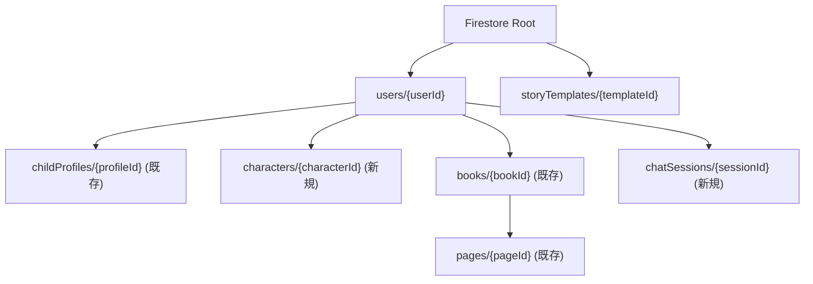
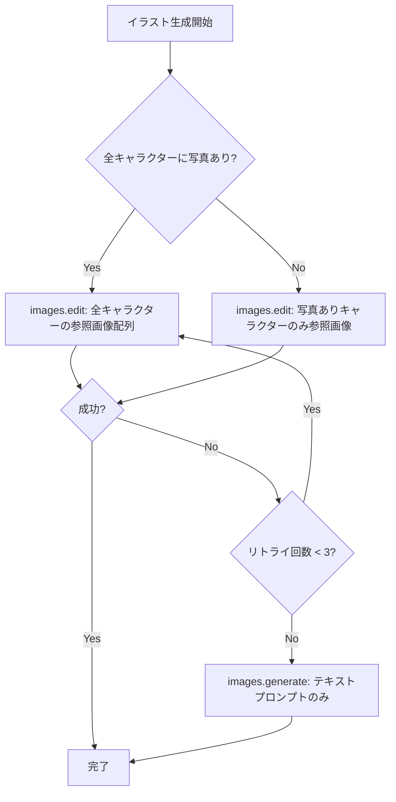
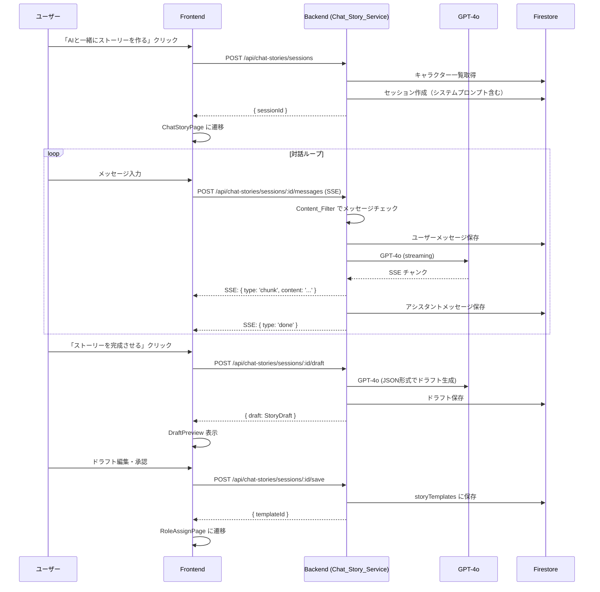
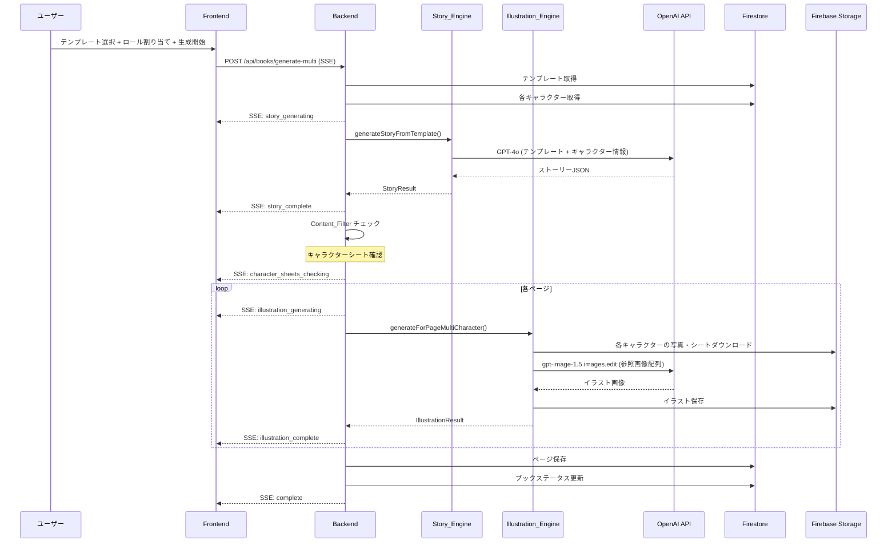

# マルチキャラクターストーリー 設計書

## 概要

本設計書は、既存の単一キャラクター絵本アプリをマルチキャラクター対応に拡張するための技術設計を定義する。主な追加機能は以下の通り:

1. **ストーリーテンプレート管理** — 管理者が各ページの登場キャラクターロールを定義したテンプレートを CRUD 管理
2. **キャラクター登録・管理** — 保護者が複数キャラクター（パパ、ママ、兄弟等）を事前登録し、キャラクターシートを自動生成
3. **マルチキャラクター生成フロー** — テンプレート選択 → ロール割り当て → ストーリー生成 → 複数キャラクター参照画像によるイラスト生成
4. **LLM チャットストーリー作成** — GPT-4o との対話でオリジナルストーリーを構築し、テンプレートとして保存
5. **後方互換性** — 既存の単一キャラクターフロー（プロフィール → テーマ → 生成）を維持

既存アーキテクチャ（Express + React + Firebase + OpenAI）を踏襲し、新規サービス・ルート・ページを追加する形で実装する。

## アーキテクチャ

### 全体構成

```mermaid
graph TB
    subgraph Frontend["packages/frontend (React + Vite)"]
        Dashboard[DashboardPage]
        CharList[CharacterListPage]
        CharForm[CharacterFormPage]
        TplSelect[TemplateSelectPage]
        RoleAssign[RoleAssignPage]
        ChatStory[ChatStoryPage]
        MultiGen[MultiGeneratingPage]
    end

    subgraph Backend["packages/backend (Express)"]
        CharRoute["/api/characters"]
        TplRoute["/api/templates"]
        ChatRoute["/api/chat-stories"]
        BooksRoute["/api/books (既存 + 拡張)"]
    end

    subgraph Services["サービス層"]
        CharSvc[Character_Service]
        TplSvc[Template_Service]
        ChatSvc[Chat_Story_Service]
        StoryEng[Story_Engine (拡張)]
        IlluEng[Illustration_Engine (拡張)]
        ContentFlt[Content_Filter (既存)]
        PhotoSvc[Photo_Upload_Service (既存)]
    end

    subgraph External["外部サービス"]
        Firestore[(Firestore)]
        Storage[(Firebase Storage)]
        OpenAI[OpenAI API]
    end

    Dashboard --> CharList
    Dashboard --> TplSelect
    Dashboard --> ChatStory
    CharList --> CharForm
    TplSelect --> RoleAssign
    RoleAssign --> MultiGen

    CharRoute --> CharSvc
    TplRoute --> TplSvc
    ChatRoute --> ChatSvc
    BooksRoute --> StoryEng
    BooksRoute --> IlluEng

    CharSvc --> Firestore
    CharSvc --> Storage
    CharSvc --> OpenAI
    CharSvc --> ContentFlt
    TplSvc --> Firestore
    ChatSvc --> Firestore
    ChatSvc --> OpenAI
    ChatSvc --> ContentFlt
    StoryEng --> OpenAI
    IlluEng --> OpenAI
    IlluEng --> Storage
```

### 設計方針

- **既存サービスの拡張**: `story-engine.ts` と `illustration-engine.ts` にマルチキャラクター対応メソッドを追加。既存メソッドは変更しない（後方互換性）
- **新規サービスの追加**: `character-service.ts`、`template-service.ts`、`chat-story-service.ts` を新規作成
- **新規ルートの追加**: `/api/characters`、`/api/templates`、`/api/chat-stories` を新規作成
- **SSE パターンの踏襲**: 既存の `books.ts` の SSE パターン（`sendSSE` + `res.flushHeaders()`）を踏襲
- **プロキシ対応**: 既存の `createOpenAIClient()` をそのまま使用（プロキシ対応済み）

## コンポーネントとインターフェース

### バックエンド — 新規サービス

#### Character_Service (`character-service.ts`)

```typescript
// キャラクタープロフィールの CRUD + キャラクターシート生成
export interface CharacterProfile {
  name: string;
  role: 'protagonist' | 'papa' | 'mama' | 'sibling' | 'other';
  age: number | null;
  gender: string | null;
  appearance: string | null;
  photoStoragePath: string | null;
  photoUrl: string | null;
  characterSheetPath: string | null;
  characterSheetStatus: 'none' | 'generating' | 'completed' | 'failed';
  appearanceDescription: string | null;
  createdAt: Timestamp;
  updatedAt: Timestamp;
}

// CRUD
createCharacter(userId: string, data: CreateCharacterInput): Promise<CharacterResponse>
getCharacters(userId: string): Promise<CharacterResponse[]>
getCharacterById(userId: string, characterId: string): Promise<CharacterResponse | null>
updateCharacter(userId: string, characterId: string, data: UpdateCharacterInput): Promise<CharacterResponse | null>
deleteCharacter(userId: string, characterId: string): Promise<boolean>

// 写真・キャラクターシート
uploadCharacterPhoto(userId: string, characterId: string, fileBuffer: Buffer): Promise<PhotoUploadResult>
generateCharacterSheetForCharacter(userId: string, characterId: string): Promise<void>
replaceCharacterPhoto(userId: string, characterId: string, fileBuffer: Buffer): Promise<PhotoUploadResult>
```

#### Template_Service (`template-service.ts`)

```typescript
export interface StoryTemplate {
  title: string;
  description: string;
  ageRange: { min: number; max: number };
  theme: Theme;
  roles: TemplateRole[];
  pages: PageTemplate[];
  archived: boolean;
  source: 'admin' | 'chat';
  creatorId: string | null;  // null = 公開テンプレート, userId = プライベート
  createdAt: Timestamp;
  updatedAt: Timestamp;
}

export interface TemplateRole {
  role: string;           // 'protagonist', 'papa', 'mama', 'sibling', etc.
  label: string;          // 表示名: '主人公', 'パパ', 'ママ'
  required: boolean;
}

export interface PageTemplate {
  pageNumber: number;
  textTemplate: string;   // "{protagonist}と{papa}は森に出かけました"
  roles: string[];        // このページに登場するロール: ['protagonist', 'papa']
  outfitTemplate: string; // "[protagonist] red T-shirt... [papa] blue polo..."
}

// CRUD
createTemplate(data: CreateTemplateInput): Promise<TemplateResponse>
getTemplates(userId?: string): Promise<TemplateResponse[]>  // 公開 + ユーザーのプライベート
getTemplateById(templateId: string): Promise<TemplateResponse | null>
updateTemplate(templateId: string, data: UpdateTemplateInput): Promise<TemplateResponse | null>
archiveTemplate(templateId: string): Promise<boolean>

// バリデーション
validateTemplate(data: CreateTemplateInput): ValidationResult
```

#### Chat_Story_Service (`chat-story-service.ts`)

```typescript
export interface ChatSession {
  userId: string;
  title: string;
  characters: CharacterSummary[];  // セッション開始時のキャラクター情報
  messages: ChatMessage[];
  draft: StoryDraft | null;
  status: 'active' | 'completed' | 'abandoned';
  createdAt: Timestamp;
  updatedAt: Timestamp;
}

export interface ChatMessage {
  role: 'user' | 'assistant' | 'system';
  content: string;
  timestamp: Timestamp;
}

export interface StoryDraft {
  title: string;
  pages: DraftPage[];
  roles: TemplateRole[];
}

export interface DraftPage {
  pageNumber: number;
  text: string;
  roles: string[];
  outfit: string;
}

// セッション管理
createSession(userId: string, characters: CharacterSummary[]): Promise<string>
getSession(userId: string, sessionId: string): Promise<ChatSession | null>
getSessions(userId: string): Promise<ChatSessionSummary[]>

// チャット（SSE ストリーミング）
sendMessage(userId: string, sessionId: string, message: string, res: Response): Promise<void>

// ドラフト管理
generateDraft(userId: string, sessionId: string): Promise<StoryDraft>
saveDraftAsTemplate(userId: string, sessionId: string, isPublic: boolean): Promise<string>
```

### バックエンド — 既存サービスの拡張

#### Story_Engine 拡張

```typescript
// 新規メソッド: テンプレートベースのストーリー生成
export async function generateStoryFromTemplate(
  template: StoryTemplate,
  characterAssignments: Map<string, CharacterProfile>,
  openaiClient?: OpenAI
): Promise<StoryResult>
```

#### Illustration_Engine 拡張

```typescript
// 新規メソッド: マルチキャラクター対応イラスト生成
export async function generateForPageMultiCharacter(
  page: { pageNumber: number; text: string; outfit?: string },
  characters: Map<string, { profile: CharacterProfile; photoBuffer?: Buffer; characterSheetBuffer?: Buffer }>,
  pageRoles: string[],
  theme: Theme,
  options: { userId: string; bookId: string; openaiClient?: OpenAI; storageBucket?: StorageBucket }
): Promise<IllustrationResult>
```

### バックエンド — 新規ルート

#### `/api/characters` ルート

| メソッド | パス | 説明 |
|---------|------|------|
| GET | `/api/characters` | キャラクター一覧取得 |
| POST | `/api/characters` | キャラクター登録（FormData: name, role, age, gender, appearance, photo） |
| GET | `/api/characters/:id` | キャラクター詳細取得 |
| PUT | `/api/characters/:id` | キャラクター情報更新 |
| DELETE | `/api/characters/:id` | キャラクター削除 |
| PUT | `/api/characters/:id/photo` | 写真差し替え（FormData: photo） |
| POST | `/api/characters/:id/regenerate-sheet` | キャラクターシート再生成 |

#### `/api/templates` ルート

| メソッド | パス | 説明 |
|---------|------|------|
| GET | `/api/templates` | テンプレート一覧取得（公開 + 自分のプライベート） |
| POST | `/api/templates` | テンプレート作成（管理者のみ公開可） |
| GET | `/api/templates/:id` | テンプレート詳細取得 |
| PUT | `/api/templates/:id` | テンプレート更新 |
| DELETE | `/api/templates/:id` | テンプレート論理削除（archived） |

#### `/api/chat-stories` ルート

| メソッド | パス | 説明 |
|---------|------|------|
| POST | `/api/chat-stories/sessions` | チャットセッション作成 |
| GET | `/api/chat-stories/sessions` | セッション一覧取得 |
| GET | `/api/chat-stories/sessions/:id` | セッション詳細取得 |
| POST | `/api/chat-stories/sessions/:id/messages` | メッセージ送信（SSE レスポンス） |
| POST | `/api/chat-stories/sessions/:id/draft` | ドラフト生成要求 |
| POST | `/api/chat-stories/sessions/:id/save` | ドラフトをテンプレートとして保存 |

#### `/api/books/generate-multi` ルート（既存 books ルートに追加）

| メソッド | パス | 説明 |
|---------|------|------|
| POST | `/api/books/generate-multi` | マルチキャラクター絵本生成（SSE レスポンス） |

リクエストボディ:
```typescript
{
  templateId: string;
  characterAssignments: Record<string, string>;  // { [role]: characterId }
  pageCount?: number;
}
```

### フロントエンド — 新規ページ・コンポーネント

#### 新規ページ

| ページ | パス | 説明 |
|--------|------|------|
| CharacterListPage | `/characters` | キャラクター一覧・管理 |
| CharacterFormPage | `/characters/new`, `/characters/:id/edit` | キャラクター登録・編集 |
| TemplateSelectPage | `/templates` | テンプレート選択 |
| RoleAssignPage | `/templates/:templateId/assign` | ロール割り当て |
| ChatStoryPage | `/chat-stories/:sessionId?` | チャットストーリー作成 |
| MultiGeneratingPage | `/generating-multi/:bookId` | マルチキャラクター生成進捗 |

#### 新規コンポーネント

| コンポーネント | 説明 |
|---------------|------|
| CharacterCard | キャラクターのサムネイル・名前・ロール・ステータス表示 |
| RoleAssignmentPanel | ロールごとのキャラクター割り当てUI |
| ChatMessageList | チャット会話履歴表示 |
| ChatInput | メッセージ入力欄 |
| DraftPreview | ストーリードラフトのプレビュー・編集UI |
| CharacterSheetStatus | キャラクターシート生成ステータスインジケーター |

### フロントエンド — ルーティング拡張

```typescript
// App.tsx に追加するルート
<Route path="/characters" element={<ProtectedRoute><CharacterListPage /></ProtectedRoute>} />
<Route path="/characters/new" element={<ProtectedRoute><CharacterFormPage /></ProtectedRoute>} />
<Route path="/characters/:id/edit" element={<ProtectedRoute><CharacterFormPage /></ProtectedRoute>} />
<Route path="/templates" element={<ProtectedRoute><TemplateSelectPage /></ProtectedRoute>} />
<Route path="/templates/:templateId/assign" element={<ProtectedRoute><RoleAssignPage /></ProtectedRoute>} />
<Route path="/chat-stories" element={<ProtectedRoute><ChatStoryPage /></ProtectedRoute>} />
<Route path="/chat-stories/:sessionId" element={<ProtectedRoute><ChatStoryPage /></ProtectedRoute>} />
<Route path="/generating-multi/:bookId" element={<ProtectedRoute><MultiGeneratingPage /></ProtectedRoute>} />
```

### ダッシュボード拡張

DashboardPage に3つの導線を追加:

```
┌─────────────────────────────────────────────┐
│  マイ絵本                        ログアウト  │
├─────────────────────────────────────────────┤
│                                             │
│  ┌──────────┐ ┌──────────┐ ┌──────────┐   │
│  │テンプレート│ │ 自由に  │ │ AIと一緒に│   │
│  │ から作成  │ │  作成   │ │ストーリー │   │
│  │          │ │(従来)   │ │  を作る   │   │
│  └──────────┘ └──────────┘ └──────────┘   │
│                                             │
│  ┌──────────┐                               │
│  │キャラクター│                               │
│  │  管理    │                               │
│  └──────────┘                               │
│                                             │
│  [絵本一覧...]                               │
└─────────────────────────────────────────────┘
```


## データモデル

### Firestore コレクション構成



### 新規コレクション: `users/{userId}/characters/{characterId}`

キャラクタープロフィールドキュメント。既存の `childProfiles` とは別コレクションとして管理する（後方互換性のため）。

```typescript
interface CharacterDoc {
  name: string;                    // キャラクター名（必須）
  role: 'protagonist' | 'papa' | 'mama' | 'sibling' | 'other';  // 役割（必須）
  age: number | null;              // 年齢
  gender: string | null;           // 性別
  appearance: string | null;       // 外見の特徴（テキスト）
  photoStoragePath: string | null; // Firebase Storage パス: users/{userId}/characters/{characterId}/photo.png
  photoUrl: string | null;         // 署名付きURL
  characterSheetPath: string | null;   // Firebase Storage パス: users/{userId}/characters/{characterId}/character_sheet.png
  characterSheetStatus: 'none' | 'generating' | 'completed' | 'failed';
  appearanceDescription: string | null; // GPT-4o Vision による外見記述（英語）
  createdAt: Timestamp;
  updatedAt: Timestamp;
}
```

**インデックス**: `createdAt` DESC（一覧取得用）

**制約**: 1ユーザーあたり最大10件。`createCharacter` 時にカウントチェック。

### 新規コレクション: `storyTemplates/{templateId}`（トップレベル）

ストーリーテンプレートドキュメント。公開テンプレートとプライベートテンプレートを同一コレクションで管理し、`creatorId` で区別する。

```typescript
interface StoryTemplateDoc {
  title: string;                   // テンプレートタイトル
  description: string;             // 説明文
  ageRange: { min: number; max: number };  // 対象年齢範囲
  theme: Theme;                    // テーマ
  roles: TemplateRoleDoc[];        // 定義されたロール一覧
  pages: PageTemplateDoc[];        // ページテンプレート配列
  archived: boolean;               // 論理削除フラグ
  source: 'admin' | 'chat';       // 作成元
  creatorId: string | null;        // null = 公開, userId = プライベート
  createdAt: Timestamp;
  updatedAt: Timestamp;
}

interface TemplateRoleDoc {
  role: string;       // ロール識別子: 'protagonist', 'papa', 'mama', 'sibling'
  label: string;      // 表示名: '主人公', 'パパ', 'ママ', '兄弟'
  required: boolean;  // 必須ロールかどうか
}

interface PageTemplateDoc {
  pageNumber: number;
  textTemplate: string;   // プレースホルダー付きテキスト: "{protagonist}と{papa}は..."
  roles: string[];        // このページに登場するロール
  outfitTemplate: string; // "[protagonist] red T-shirt... [papa] blue polo..."
}
```

**クエリパターン**:
- 公開テンプレート一覧: `where('archived', '==', false).where('creatorId', '==', null)`
- ユーザーのプライベート: `where('archived', '==', false).where('creatorId', '==', userId)`
- 両方を取得して結合（2クエリ）

### 新規コレクション: `users/{userId}/chatSessions/{sessionId}`

チャットストーリーセッションドキュメント。会話履歴とドラフトを保持する。

```typescript
interface ChatSessionDoc {
  title: string;                       // セッションタイトル（自動生成 or ユーザー指定）
  characters: CharacterSummaryDoc[];   // セッション開始時のキャラクター情報スナップショット
  messages: ChatMessageDoc[];          // 会話履歴（最大50件）
  draft: StoryDraftDoc | null;         // LLM が生成したドラフト
  status: 'active' | 'completed' | 'abandoned';
  createdAt: Timestamp;
  updatedAt: Timestamp;
}

interface CharacterSummaryDoc {
  characterId: string;
  name: string;
  role: string;
  age: number | null;
}

interface ChatMessageDoc {
  role: 'user' | 'assistant' | 'system';
  content: string;
  timestamp: Timestamp;
}

interface StoryDraftDoc {
  title: string;
  pages: DraftPageDoc[];
  roles: TemplateRoleDoc[];
}

interface DraftPageDoc {
  pageNumber: number;
  text: string;
  roles: string[];
  outfit: string;
}
```

**制約**: `messages` 配列は最大50件。超過時はエラーを返す。

### 既存コレクションの拡張: `users/{userId}/books/{bookId}`

既存の `BookDoc` に以下のオプショナルフィールドを追加:

```typescript
interface BookDoc {
  // ... 既存フィールド ...
  profileId: string;        // 既存（単一キャラクターフロー用）
  
  // 新規フィールド（マルチキャラクターフロー用、オプショナル）
  templateId?: string;      // 使用したテンプレートID
  characterAssignments?: Record<string, string>;  // { [role]: characterId }
  generationType?: 'single' | 'multi';  // 生成タイプ（デフォルト: 'single'）
}
```

既存の `profileId` フィールドは維持する。マルチキャラクターフローでは `profileId` に protagonist のキャラクターIDを設定し、`characterAssignments` に全ロールのマッピングを保存する。

### Firebase Storage パス構成

```
users/{userId}/
  characters/{characterId}/
    photo.png                    # アップロード写真
    character_sheet.png          # 生成されたキャラクターシート
  books/{bookId}/
    illustrations/
      page-{pageNumber}.png      # 生成されたイラスト（既存と同じ）
```

### Zod バリデーションスキーマ（`packages/shared/src/schemas.ts` に追加）

```typescript
export const CharacterRoleSchema = z.enum([
  'protagonist', 'papa', 'mama', 'sibling', 'other'
]);

export const CreateCharacterSchema = z.object({
  name: z.string().min(1, '名前は必須です').max(50),
  role: CharacterRoleSchema,
  age: z.number().int().min(0).max(120).optional(),
  gender: z.string().optional(),
  appearance: z.string().max(500).optional(),
});

export const UpdateCharacterSchema = z.object({
  name: z.string().min(1).max(50).optional(),
  role: CharacterRoleSchema.optional(),
  age: z.number().int().min(0).max(120).optional(),
  gender: z.string().optional(),
  appearance: z.string().max(500).optional(),
});

export const CreateTemplateSchema = z.object({
  title: z.string().min(1).max(100),
  description: z.string().max(500),
  ageRange: z.object({ min: z.number().int().min(0), max: z.number().int().max(17) }),
  theme: ThemeSchema,
  roles: z.array(z.object({
    role: z.string().min(1),
    label: z.string().min(1),
    required: z.boolean(),
  })).min(1),
  pages: z.array(z.object({
    pageNumber: z.number().int().min(1),
    textTemplate: z.string().min(1),
    roles: z.array(z.string()).min(1),
    outfitTemplate: z.string(),
  })).min(1).max(16),
});

export const GenerateMultiBookSchema = z.object({
  templateId: z.string().min(1),
  characterAssignments: z.record(z.string(), z.string()),
  pageCount: z.number().int().min(1).max(16).optional(),
});

export const ChatMessageSchema = z.object({
  message: z.string().min(1).max(2000),
});
```

## マルチキャラクターイラスト生成戦略

### 参照画像配列の構成

gpt-image-1.5 の `images.edit` は `image` パラメータに画像配列を受け付ける。マルチキャラクターの場合、各キャラクターのキャラクターシートと元写真をペアで配列に含める。

```
image 配列: [
  キャラクター1のキャラクターシート,  // アンカー画像
  キャラクター1の元写真,
  キャラクター2のキャラクターシート,
  キャラクター2の元写真,
  ...
]
```

**制約事項**:
- `image` 配列に `mask` は使用不可（既知の制約: "mask size does not match image size"）
- 写真未登録キャラクターはテキストプロンプトのみで描画（参照画像なし）
- キャラクターシート未完了の場合は元写真を2枚渡す従来方式にフォールバック

### プロンプト構成

```
HIGHEST PRIORITY — CHARACTER CONSISTENCY:
- Reference images are provided in pairs: [character_sheet, original_photo]
- FIRST pair (images 1-2) = {protagonist_name} (protagonist)
- SECOND pair (images 3-4) = {papa_name} (papa)
- Each character MUST match their respective character sheet EXACTLY

CHARACTER DETAILS:
[protagonist] {name}, age {age}, {appearance}
  Outfit: {outfit}
[papa] {name}, age {age}, {appearance}
  Outfit: {outfit}

SCENE:
Theme: {theme}
Story text: "{page_text}"

STYLE:
- Warm, colorful watercolor picture book illustration
- All characters must be clearly distinguishable
- No text or words in the image
```

### フォールバック戦略



## チャットストーリー作成フロー

### シーケンス図



### SSE イベント形式（チャット用）

```typescript
type ChatSSEEvent =
  | { type: 'chunk'; content: string }       // LLM の応答チャンク
  | { type: 'done'; messageId: string }      // 応答完了
  | { type: 'error'; message: string }       // エラー
  | { type: 'content_filtered'; message: string }  // コンテンツフィルターで拒否
```

### システムプロンプト構成

```
あなたは子供向け絵本のストーリー作家アシスタントです。
ユーザーと対話しながら、オリジナルの絵本ストーリーを一緒に作ります。

## 登録済みキャラクター
{characters.map(c => `- ${c.name}（${c.role}、${c.age}歳）`).join('\n')}

## ルール
- 子供向けの安全で楽しいストーリーのみ提案してください
- 暴力的、性的、恐怖を与える内容は絶対に含めないでください
- ユーザーの希望を聞きながら、ストーリーの展開を提案してください
- 各ページは短い文章（対象年齢に応じて15〜80文字）にしてください
```

## マルチキャラクター絵本生成フロー全体

### シーケンス図




## 正当性プロパティ (Correctness Properties)

*プロパティとは、システムのすべての有効な実行において真であるべき特性や振る舞いのことである。プロパティは、人間が読める仕様と機械が検証可能な正当性保証の橋渡しとなる。*

### Property 1: テンプレート CRUD ラウンドトリップ

*For any* 有効なストーリーテンプレートデータに対して、テンプレートを作成し、その後取得した場合、取得結果のタイトル・説明・テーマ・ロール一覧・ページ配列が作成時のデータと一致すること。また、テンプレートを更新し再取得した場合、更新後のデータが反映されていること。

**Validates: Requirements 1.1, 1.4**

### Property 2: テンプレート構造の完全性

*For any* 作成されたストーリーテンプレートに対して、各ページテンプレートがページ番号、テキストテンプレート、登場キャラクターロール一覧、outfit テンプレートのフィールドを含み、かつ各ロール定義が `role`、`label`、`required` フィールドを含むこと。

**Validates: Requirements 1.2, 1.6**

### Property 3: テンプレートロール参照の整合性

*For any* ストーリーテンプレートに対して、各ページの `roles` 配列に含まれるすべてのロールが、テンプレート全体の `roles` 定義に存在すること。存在しないロールを参照するページを含むテンプレートはバリデーションエラーとなること。

**Validates: Requirements 1.3**

### Property 4: アーカイブテンプレートの除外

*For any* テンプレート一覧クエリに対して、`archived: true` のテンプレートが結果に含まれないこと。テンプレートをアーカイブした後、一覧取得で返されないこと。

**Validates: Requirements 1.5, 4.1**

### Property 5: キャラクター CRUD ラウンドトリップ

*For any* 有効なキャラクタープロフィールデータに対して、キャラクターを作成し、その後取得した場合、取得結果の名前・役割・年齢・性別・外見情報が作成時のデータと一致すること。

**Validates: Requirements 2.1**

### Property 6: キャラクター写真ストレージパスの正確性

*For any* userId と characterId の組み合わせに対して、写真のストレージパスが `users/{userId}/characters/{characterId}/photo.png` の形式に従うこと。

**Validates: Requirements 2.3**

### Property 7: 写真アップロードによるキャラクターシートライフサイクル

*For any* キャラクターに対して、写真アップロード完了後に `characterSheetStatus` が `generating` に遷移すること。シート生成完了後に `characterSheetStatus` が `completed` に遷移し、`characterSheetPath` が非 null であること。

**Validates: Requirements 2.4, 2.5**

### Property 8: キャラクター登録数上限の強制

*For any* ユーザーに対して、キャラクター数が10件に達している場合、新規キャラクター作成が拒否されること。キャラクター数が10件未満の場合は作成が成功すること。

**Validates: Requirements 2.7**

### Property 9: キャラクターシートプロンプトの構成

*For any* キャラクターに対して、キャラクターシート生成プロンプトがキャラクターの名前、年齢、役割を含むこと。さらに、大人ロール（papa, mama）の場合は「大人の体型」に関する指示を含み、子供ロール（protagonist, sibling）の場合は「子供の体型」に関する指示を含むこと。

**Validates: Requirements 3.2, 3.3, 3.4**

### Property 10: キャラクターシート API 呼び出し形式

*For any* キャラクターシート生成リクエストに対して、`images.edit` エンドポイントに渡される `image` パラメータが同一写真2枚の配列であること。

**Validates: Requirements 3.1**

### Property 11: 重複キャラクター割り当ての防止

*For any* キャラクター割り当てマップに対して、同一の characterId が複数のロールに割り当てられている場合、バリデーションエラーとなること。

**Validates: Requirements 5.2**

### Property 12: 必須ロール割り当ての検証

*For any* テンプレートとキャラクター割り当てマップに対して、テンプレートの必須ロールすべてに characterId が割り当てられている場合のみ生成が許可されること。必須ロールが1つでも未割り当ての場合は拒否されること。

**Validates: Requirements 5.3**

### Property 13: テンプレートプレースホルダーの置換

*For any* テンプレートテキストとキャラクター割り当てマップに対して、テキスト内の `{role}` 形式のプレースホルダーがすべて対応するキャラクター名で置換されること。置換後のテキストにプレースホルダーが残っていないこと（割り当て済みロールについて）。

**Validates: Requirements 6.1**

### Property 14: マルチキャラクターストーリープロンプトの構成

*For any* キャラクター割り当てセットに対して、Story_Engine が GPT-4o に送信するプロンプトが各キャラクターの名前、年齢、役割、外見情報を含むこと。

**Validates: Requirements 6.2**

### Property 15: マルチキャラクター outfit ラベリング

*For any* 複数キャラクターが登場するページに対して、outfit フィールドが各キャラクターのロールラベル（`[protagonist]`、`[papa]` 等）を含み、各ラベルの後に服装記述が続くこと。

**Validates: Requirements 6.3**

### Property 16: 参照画像配列の構成と順序

*For any* N人の写真登録済みキャラクターが登場するページに対して、参照画像配列が 2*N 枚の画像を含み、`[シート1, 写真1, シート2, 写真2, ...]` の順序で構成されること。

**Validates: Requirements 7.1, 7.2**

### Property 17: マルチキャラクターイラストプロンプトの構成

*For any* 複数キャラクターが登場するページに対して、イラスト生成プロンプトが各キャラクターの名前、役割、外見記述、outfit を含み、「FIRST pair = character 1, SECOND pair = character 2」のように参照画像とキャラクターの対応を明示すること。

**Validates: Requirements 7.3**

### Property 18: 部分的写真参照の処理

*For any* 写真登録済みキャラクターと未登録キャラクターが混在するページに対して、参照画像配列が写真登録済みキャラクターのみの画像を含み、未登録キャラクターの画像を含まないこと。

**Validates: Requirements 7.4**

### Property 19: 後方互換性のコードパス選択

*For any* `templateId` を含まない生成リクエストに対して、既存の `generateStory` 関数が呼び出されること。`characterAssignments` を含まないリクエストに対して、既存の `generateForPage` 関数が呼び出されること。

**Validates: Requirements 9.2, 9.3**

### Property 20: キャラクター写真のコンテンツ安全性とファイル検証

*For any* キャラクター写真アップロードに対して、Content_Filter による安全性チェックが実行されること。不適切と判定された画像は保存されずエラーが返ること。また、JPEG/PNG/WebP 以外のファイル形式、または 10MB を超えるファイルが拒否されること。

**Validates: Requirements 10.1, 10.2, 10.4**

### Property 21: 写真差し替え時のクリーンアップと再生成

*For any* キャラクターの写真差し替えに対して、既存の写真とキャラクターシートが Storage から削除され、新しい写真が保存され、キャラクターシート再生成が開始されること。

**Validates: Requirements 11.2**

### Property 22: キャラクター削除時のクリーンアップ

*For any* キャラクター削除に対して、関連する写真とキャラクターシートが Storage から削除され、Firestore ドキュメントが削除されること。削除後にキャラクターを取得すると null が返ること。

**Validates: Requirements 11.3**

### Property 23: プロフィール更新時のシート非再生成

*For any* キャラクターの名前や外見情報の更新（写真変更なし）に対して、`characterSheetPath` と `characterSheetStatus` が変更されないこと。

**Validates: Requirements 11.5**

### Property 24: チャットセッションシステムプロンプトの構成

*For any* チャットセッション作成時に渡されたキャラクター一覧に対して、LLM のシステムプロンプトが各キャラクターの名前と年齢を含むこと。

**Validates: Requirements 12.3**

### Property 25: チャットメッセージ永続化ラウンドトリップ

*For any* チャットセッションに送信されたメッセージに対して、セッションを再取得した場合、送信したメッセージが会話履歴に含まれていること。

**Validates: Requirements 12.5**

### Property 26: ドラフトからテンプレートへのラウンドトリップ

*For any* 承認されたストーリードラフトに対して、`storyTemplates` コレクションに保存されたテンプレートが `source: 'chat'` フラグを持ち、ドラフトのタイトル・ページ・ロールが保持されていること。

**Validates: Requirements 12.8**

### Property 27: チャットコンテンツ安全性の強制

*For any* チャットセッションへのユーザーメッセージに対して、Content_Filter による安全性チェックが実行されること。不適切と判定されたメッセージは処理されずエラーが返ること。

**Validates: Requirements 12.10**

### Property 28: チャットメッセージ数上限の強制

*For any* チャットセッションに対して、メッセージ数が50件に達している場合、新規メッセージ送信が拒否されること。

**Validates: Requirements 12.11**

### Property 29: テンプレート公開範囲の制御

*For any* チャットで作成されたテンプレートに対して、管理者が作成した場合は `creatorId` が null（公開）となり、保護者が作成した場合は `creatorId` がユーザーIDと一致する（プライベート）こと。

**Validates: Requirements 12.12, 12.13**


## エラーハンドリング

### サービス層のエラー分類

| エラー種別 | HTTP ステータス | コード | リトライ可能 | 説明 |
|-----------|---------------|--------|------------|------|
| バリデーションエラー | 400 | `VALIDATION_ERROR` | No | 入力データの形式不正 |
| コンテンツ不適切 | 400 | `CONTENT_UNSAFE` | No | Content_Filter による拒否 |
| 上限超過 | 400 | `LIMIT_EXCEEDED` | No | キャラクター数上限、メッセージ数上限 |
| 重複割り当て | 400 | `DUPLICATE_ASSIGNMENT` | No | 同一キャラクターの複数ロール割り当て |
| 必須ロール未割り当て | 400 | `MISSING_REQUIRED_ROLES` | No | 必須ロールにキャラクター未割り当て |
| 未認証 | 401 | `UNAUTHORIZED` | No | 認証トークン不正・期限切れ |
| リソース未検出 | 404 | `NOT_FOUND` | No | テンプレート・キャラクター・セッション未検出 |
| 使用中削除拒否 | 409 | `IN_USE` | No | 生成中の絵本で使用中のキャラクター削除 |
| OpenAI API エラー | 500 | `GENERATION_ERROR` | Yes | ストーリー・イラスト・シート生成失敗 |
| 内部エラー | 500 | `INTERNAL_ERROR` | Yes | Firestore・Storage 操作失敗 |

### リトライ戦略

既存パターンを踏襲:

```typescript
const RETRY_DELAYS = [1000, 2000, 4000]; // 指数バックオフ

// 最大3回リトライ（初回 + 3回 = 計4回試行）
for (let attempt = 0; attempt <= RETRY_DELAYS.length; attempt++) {
  try {
    return await operation();
  } catch (error) {
    if (attempt < RETRY_DELAYS.length) {
      await sleep(RETRY_DELAYS[attempt]);
    }
  }
}
```

適用対象:
- キャラクターシート生成（`generateCharacterSheet`）
- マルチキャラクターイラスト生成（`generateForPageMultiCharacter`）
- ストーリー生成（`generateStoryFromTemplate`）
- チャット LLM 呼び出し

### SSE エラーイベント

生成中のエラーは SSE で通知し、フロントエンドで再試行ボタンを表示:

```typescript
sendSSE(res, {
  type: 'error',
  message: 'エラーメッセージ',
  retryable: true  // or false
});
res.end();
```

### キャラクターシート生成失敗時の graceful degradation

キャラクターシート生成が失敗しても、絵本生成フロー全体は継続可能:

1. `characterSheetStatus` を `failed` に設定
2. イラスト生成時にキャラクターシートがない場合:
   - 元写真がある → 写真を2枚渡す従来方式にフォールバック
   - 写真もない → テキストプロンプトのみで描画

## テスト戦略

### テストフレームワーク

- **テストランナー**: Vitest（既存プロジェクトで使用中）
- **プロパティベーステスト**: `fast-check` ライブラリ
- **設定**: 各プロパティテストは最低100イテレーション

### ユニットテスト

具体的な例やエッジケースを検証:

| テスト対象 | テスト内容 |
|-----------|-----------|
| `template-service` | テンプレート CRUD 操作、バリデーションエラーケース |
| `character-service` | キャラクター CRUD、写真アップロード、上限チェック |
| `chat-story-service` | セッション管理、メッセージ上限、ドラフト保存 |
| `story-engine` (拡張) | テンプレートベース生成、プレースホルダー置換 |
| `illustration-engine` (拡張) | 参照画像配列構成、フォールバック動作 |
| Zod スキーマ | 各スキーマのバリデーション（正常系・異常系） |

エッジケース:
- キャラクターシート生成失敗時のフォールバック（要件 2.6, 3.5）
- images.edit 失敗後の images.generate フォールバック（要件 7.6）
- 生成中キャラクターの削除拒否（要件 11.4）
- ネットワークエラー時の SSE エラーイベント（要件 8.5）
- GPT-4o Vision 拒否時の空文字返却（要件 3.5）

### プロパティベーステスト

各正当性プロパティに対して1つのプロパティベーステストを実装する。

テストタグ形式: `Feature: multi-character-story, Property {number}: {property_text}`

```typescript
// 例: Property 3 — テンプレートロール参照の整合性
// Feature: multi-character-story, Property 3: テンプレートロール参照の整合性
test.prop(
  'テンプレートの各ページロールがテンプレート全体のロール定義に含まれること',
  [templateArbitrary],
  (template) => {
    const result = validateTemplate(template);
    const allDefinedRoles = new Set(template.roles.map(r => r.role));
    const allPageRoles = template.pages.flatMap(p => p.roles);
    const allValid = allPageRoles.every(role => allDefinedRoles.has(role));
    expect(result.valid).toBe(allValid);
  },
  { numRuns: 100 }
);
```

```typescript
// 例: Property 13 — テンプレートプレースホルダーの置換
// Feature: multi-character-story, Property 13: テンプレートプレースホルダーの置換
test.prop(
  'テンプレートテキスト内のプレースホルダーがすべて置換されること',
  [templateTextArbitrary, characterAssignmentArbitrary],
  (textTemplate, assignments) => {
    const result = replacePlaceholders(textTemplate, assignments);
    for (const [role, character] of Object.entries(assignments)) {
      expect(result).not.toContain(`{${role}}`);
      expect(result).toContain(character.name);
    }
  },
  { numRuns: 100 }
);
```

```typescript
// 例: Property 16 — 参照画像配列の構成と順序
// Feature: multi-character-story, Property 16: 参照画像配列の構成と順序
test.prop(
  '参照画像配列がキャラクターごとにシート・写真ペアで構成されること',
  [characterListArbitrary],
  (characters) => {
    const photoCharacters = characters.filter(c => c.hasPhoto);
    const imageArray = buildReferenceImageArray(photoCharacters);
    expect(imageArray.length).toBe(photoCharacters.length * 2);
    for (let i = 0; i < photoCharacters.length; i++) {
      expect(imageArray[i * 2].name).toContain('sheet');
      expect(imageArray[i * 2 + 1].name).toContain('photo');
    }
  },
  { numRuns: 100 }
);
```

### テスト構成

```
packages/backend/src/services/__tests__/
  character-service.test.ts          # ユニットテスト
  character-service.property.test.ts # プロパティテスト
  template-service.test.ts           # ユニットテスト
  template-service.property.test.ts  # プロパティテスト
  chat-story-service.test.ts         # ユニットテスト
  chat-story-service.property.test.ts # プロパティテスト
  story-engine-multi.test.ts         # マルチキャラクター拡張のユニットテスト
  story-engine-multi.property.test.ts # プロパティテスト
  illustration-engine-multi.test.ts  # マルチキャラクター拡張のユニットテスト
  illustration-engine-multi.property.test.ts # プロパティテスト

packages/backend/src/routes/__tests__/
  characters.test.ts                 # ルートのユニットテスト
  templates.test.ts                  # ルートのユニットテスト
  chat-stories.test.ts               # ルートのユニットテスト
```

### モック戦略

- **OpenAI API**: `createOpenAIClient` をモックし、固定レスポンスを返す
- **Firestore**: インメモリ実装またはモック（既存テストパターンを踏襲）
- **Firebase Storage**: モックバケット（既存の `storageBucket` オプションパターンを踏襲）
- **Content_Filter**: `checkText` / `checkImage` をモックし、safe/unsafe を制御
