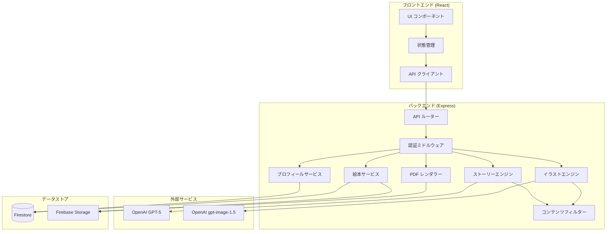
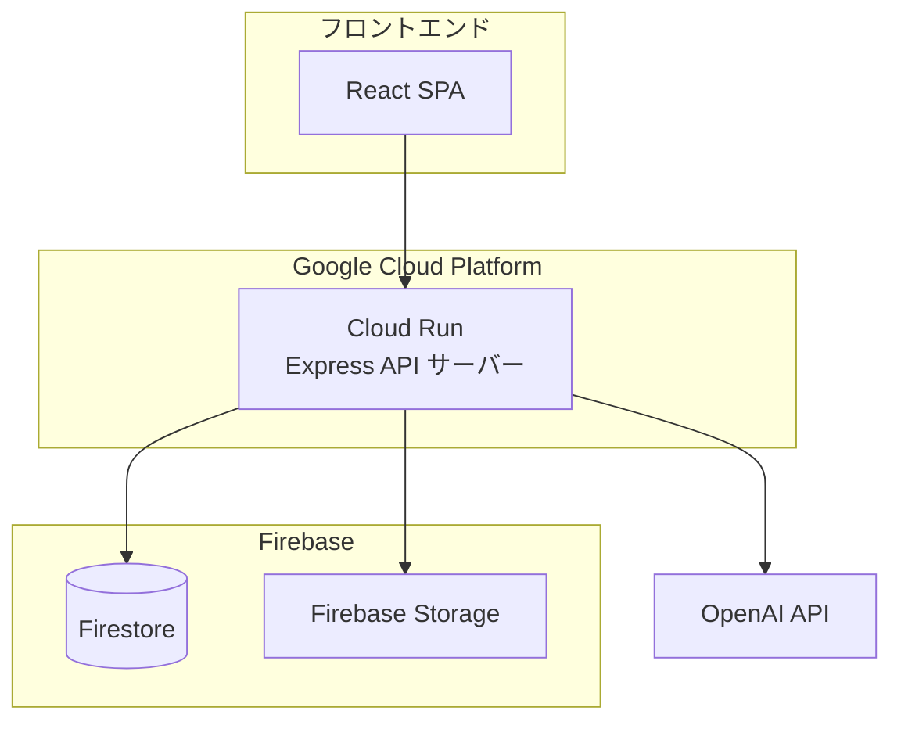
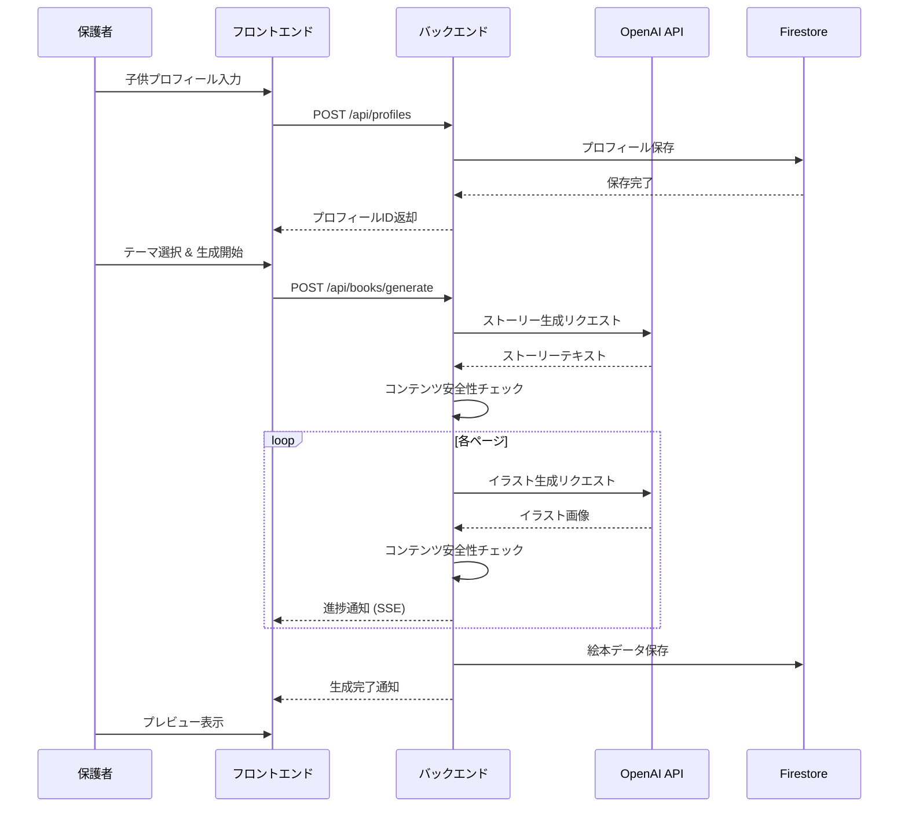
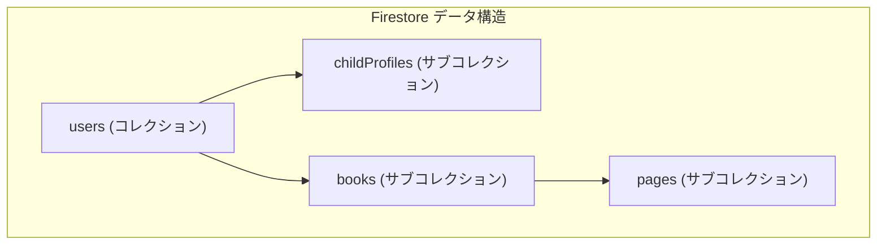

# 設計ドキュメント: パーソナライズ絵本作成アプリケーション

## 概要

本アプリケーションは、保護者が子供の情報（名前、年齢、外見、好みなど）を入力し、AI を活用してパーソナライズされた絵本を自動生成する Web アプリケーションである。

フロントエンドは React + TypeScript で構築し、バックエンドは Node.js + Express で API サーバーを提供し、Cloud Run にデプロイする。ストーリー生成には OpenAI API (GPT-5)、イラスト生成には OpenAI API (gpt-image-1.5) を利用する。データの永続化には Firebase (Firestore) を使用し、ファイルストレージには Firebase Storage を使用する。ユーザー認証には JWT ベースの認証を採用する。PDF 生成にはサーバーサイドで pdf-lib を使用する。

### 技術スタック

- **フロントエンド**: React 18, TypeScript, Vite, TailwindCSS
- **バックエンド**: Node.js, Express, TypeScript
- **デプロイ**: Cloud Run
- **データベース**: Firebase (Firestore)
- **ファイルストレージ**: Firebase Storage
- **認証**: JWT (jsonwebtoken) + bcrypt
- **ストーリー生成**: OpenAI API (GPT-5)
- **イラスト生成**: OpenAI API (gpt-image-1.5)
- **PDF 生成**: pdf-lib
- **テスト**: Vitest, fast-check (プロパティベーステスト)
- **バリデーション**: Zod

### 設計判断の根拠

1. **React + TypeScript**: 型安全性とコンポーネントベースの UI 構築に適している。絵本プレビューのようなインタラクティブな UI に最適。
2. **Express + Cloud Run**: 軽量で柔軟な API サーバー。Cloud Run によりコンテナベースでスケーラブルなデプロイが可能。AI API との連携やファイル生成処理に適している。
3. **Firebase (Firestore)**: NoSQL ドキュメントデータベースとして、ユーザー・絵本・プロフィールのデータを柔軟に管理できる。サーバーレスでスケーラブル。
4. **Firebase Storage**: 生成されたイラスト画像や PDF ファイルの保存に適しており、Firebase エコシステムとの統合が容易。
5. **OpenAI API**: ストーリー生成 (GPT-5) とイラスト生成 (gpt-image-1.5) の両方を単一プロバイダーで実現でき、統合が容易。
6. **pdf-lib**: サーバーサイドで PDF を生成でき、テキストと画像の配置を細かく制御可能。

## アーキテクチャ

### システム構成図



### デプロイ構成



### リクエストフロー



## コンポーネントとインターフェース

### フロントエンドコンポーネント

#### ページコンポーネント

| コンポーネント | 責務 |
|---|---|
| `LoginPage` | ログイン・アカウント登録画面 |
| `DashboardPage` | 保存済み絵本一覧の表示 |
| `ProfileFormPage` | 子供プロフィールの入力・編集 |
| `ThemeSelectPage` | テーマ選択画面 |
| `GeneratingPage` | 生成中の進捗表示 |
| `PreviewPage` | 絵本プレビュー・編集・ダウンロード |

#### 共通コンポーネント

| コンポーネント | 責務 |
|---|---|
| `BookViewer` | ページめくり機能付き絵本表示 |
| `PageEditor` | テキスト編集インターフェース |
| `ProgressBar` | 生成進捗の表示 |

### バックエンド API インターフェース

#### 認証 API

```typescript
// POST /api/auth/register
interface RegisterRequest {
  email: string;
  password: string;
}
interface RegisterResponse {
  userId: string;
  token: string;
}

// POST /api/auth/login
interface LoginRequest {
  email: string;
  password: string;
}
interface LoginResponse {
  token: string;
  user: { id: string; email: string };
}

// POST /api/auth/logout
// Authorization: Bearer <token>
```

#### プロフィール API

```typescript
// POST /api/profiles
interface CreateProfileRequest {
  name: string;           // 必須, 1-50文字
  age: number;            // 必須, 0-17
  gender?: string;        // 任意
  favoriteColor?: string; // 任意
  favoriteAnimal?: string;// 任意
  appearance?: string;    // 任意: 外見の特徴
}
interface ProfileResponse {
  id: string;
  name: string;
  age: number;
  gender?: string;
  favoriteColor?: string;
  favoriteAnimal?: string;
  appearance?: string;
  createdAt: string;
}
```

#### 絵本 API

```typescript
// POST /api/books/generate
interface GenerateBookRequest {
  profileId: string;
  theme: Theme;
}
// レスポンスは SSE (Server-Sent Events) で進捗を返す
// 最終レスポンス:
interface GenerateBookResponse {
  bookId: string;
  title: string;
  pages: PageData[];
}

// GET /api/books
interface BookListResponse {
  books: BookSummary[];
}
interface BookSummary {
  id: string;
  title: string;
  thumbnailUrl: string;
  createdAt: string;
  updatedAt: string;
}

// GET /api/books/:id
interface BookDetailResponse {
  id: string;
  title: string;
  profileId: string;
  theme: Theme;
  pages: PageData[];
  createdAt: string;
  updatedAt: string;
}

// PUT /api/books/:id/pages/:pageNumber
interface UpdatePageRequest {
  text: string; // 最大200文字
}

// DELETE /api/books/:id

// GET /api/books/:id/download
// レスポンス: application/pdf
```

### サービスインターフェース

```typescript
interface StoryEngine {
  generate(profile: ChildProfile, theme: Theme): Promise<StoryResult>;
}

interface StoryResult {
  title: string;
  pages: { pageNumber: number; text: string }[];
}

interface IllustrationEngine {
  generateForPage(
    page: { pageNumber: number; text: string },
    profile: ChildProfile,
    theme: Theme
  ): Promise<IllustrationResult>;
}

interface IllustrationResult {
  pageNumber: number;
  imageUrl: string; // Firebase Storage URL
}

interface ContentFilter {
  checkText(text: string): Promise<ContentCheckResult>;
  checkImage(imageUrl: string): Promise<ContentCheckResult>;
}

interface ContentCheckResult {
  safe: boolean;
  flaggedCategories: string[];
}

interface PDFRenderer {
  render(book: BookData): Promise<Buffer>;
}
```

## データモデル

### Firestore コレクション構造



### ドキュメント構造

```
users/{userId}
├── email: string
├── passwordHash: string
├── failedLoginAttempts: number
├── lockedUntil: Timestamp | null
├── createdAt: Timestamp
├── updatedAt: Timestamp
│
├── childProfiles/{profileId}
│   ├── name: string (1-50文字)
│   ├── age: number (0-17)
│   ├── gender: string | null
│   ├── favoriteColor: string | null
│   ├── favoriteAnimal: string | null
│   ├── appearance: string | null
│   ├── createdAt: Timestamp
│   └── updatedAt: Timestamp
│
└── books/{bookId}
    ├── profileId: string
    ├── title: string
    ├── theme: string
    ├── status: string ("generating" | "completed" | "error")
    ├── thumbnailUrl: string | null
    ├── createdAt: Timestamp
    ├── updatedAt: Timestamp
    │
    └── pages/{pageId}
        ├── pageNumber: number
        ├── text: string
        ├── originalText: string
        ├── imageUrl: string
        ├── createdAt: Timestamp
        └── updatedAt: Timestamp
```

### Firestore TypeScript 型定義

```typescript
import { Timestamp } from 'firebase-admin/firestore';

interface UserDoc {
  email: string;
  passwordHash: string;
  failedLoginAttempts: number;
  lockedUntil: Timestamp | null;
  createdAt: Timestamp;
  updatedAt: Timestamp;
}

interface ChildProfileDoc {
  name: string;
  age: number;
  gender: string | null;
  favoriteColor: string | null;
  favoriteAnimal: string | null;
  appearance: string | null;
  createdAt: Timestamp;
  updatedAt: Timestamp;
}

interface BookDoc {
  profileId: string;
  title: string;
  theme: string;
  status: 'generating' | 'completed' | 'error';
  thumbnailUrl: string | null;
  createdAt: Timestamp;
  updatedAt: Timestamp;
}

interface PageDoc {
  pageNumber: number;
  text: string;
  originalText: string;
  imageUrl: string;
  createdAt: Timestamp;
  updatedAt: Timestamp;
}
```

### Firestore セキュリティルール（参考）

```
rules_version = '2';
service cloud.firestore {
  match /databases/{database}/documents {
    match /users/{userId} {
      // ユーザー自身のドキュメントのみ読み書き可能（バックエンド経由のため、実際はAdmin SDKを使用）
      match /childProfiles/{profileId} {
        allow read, write: if request.auth != null && request.auth.uid == userId;
      }
      match /books/{bookId} {
        allow read, write: if request.auth != null && request.auth.uid == userId;
        match /pages/{pageId} {
          allow read, write: if request.auth != null && request.auth.uid == userId;
        }
      }
    }
  }
}
```

### Firebase Storage パス構造

```
gs://{bucket}/
├── users/{userId}/
│   └── books/{bookId}/
│       ├── illustrations/
│       │   ├── page-1.png
│       │   ├── page-2.png
│       │   └── ...
│       ├── thumbnail.png
│       └── output.pdf
```

### バリデーションスキーマ (Zod)

```typescript
import { z } from 'zod';

export const Theme = z.enum([
  'adventure',  // 冒険
  'animals',    // 動物
  'space',      // 宇宙
  'ocean',      // 海
  'magic',      // 魔法
  'friendship', // 友情
]);
export type Theme = z.infer<typeof Theme>;

export const CreateProfileSchema = z.object({
  name: z.string().min(1, '名前は必須です').max(50, '名前は50文字以内で入力してください'),
  age: z.number().int().min(0, '年齢は0歳以上で入力してください').max(17, '年齢は17歳以下で入力してください'),
  gender: z.string().optional(),
  favoriteColor: z.string().optional(),
  favoriteAnimal: z.string().optional(),
  appearance: z.string().optional(),
});

export const GenerateBookSchema = z.object({
  profileId: z.string().uuid(),
  theme: Theme,
});

export const UpdatePageSchema = z.object({
  text: z.string().max(200, 'テキストは200文字以内で入力してください'),
});

export const RegisterSchema = z.object({
  email: z.string().email('有効なメールアドレスを入力してください'),
  password: z.string().min(8, 'パスワードは8文字以上で入力してください'),
});

export const LoginSchema = z.object({
  email: z.string().email(),
  password: z.string(),
});
```

### 型定義

```typescript
// テーマの表示名マッピング
export const THEME_LABELS: Record<Theme, string> = {
  adventure: '冒険',
  animals: '動物',
  space: '宇宙',
  ocean: '海',
  magic: '魔法',
  friendship: '友情',
};

// 絵本のステータス
export type BookStatus = 'generating' | 'completed' | 'error';

// ページデータ
export interface PageData {
  pageNumber: number;
  text: string;
  originalText: string;
  imageUrl: string;
}

// 絵本データ（レンダリング用）
export interface BookData {
  id: string;
  title: string;
  theme: Theme;
  pages: PageData[];
  profile: {
    name: string;
    age: number;
  };
}

// SSE 進捗イベント
export type ProgressEvent =
  | { type: 'story_generating' }
  | { type: 'story_complete'; title: string; pageCount: number }
  | { type: 'illustration_generating'; pageNumber: number; totalPages: number }
  | { type: 'illustration_complete'; pageNumber: number }
  | { type: 'complete'; bookId: string }
  | { type: 'error'; message: string; retryable: boolean };
```

## 正確性プロパティ

*プロパティとは、システムの全ての有効な実行において真であるべき特性や振る舞いのことである。プロパティは、人間が読める仕様と機械が検証可能な正確性保証の橋渡しとなる。*

### Property 1: プロフィール保存ラウンドトリップ

*任意の*有効な子供プロフィール（名前1-50文字、年齢0-17）に対して、プロフィールを保存した後に取得すると、元のプロフィールと同一のデータが返される。

**Validates: Requirements 1.2**

### Property 2: プロフィールバリデーションによる無効データの拒否

*任意の*無効なプロフィールデータ（名前が空文字列、年齢が0未満または18以上、名前が50文字超）に対して、バリデーションは拒否し、エラー情報を返す。

**Validates: Requirements 1.3, 1.4, 1.5**

### Property 3: ストーリーに子供の名前が含まれる

*任意の*子供プロフィールとテーマの組み合わせに対して、生成されたストーリーの少なくとも1ページに子供の名前が含まれる。

**Validates: Requirements 3.1**

### Property 4: ストーリーのページ数は8-16の範囲内

*任意の*子供プロフィールとテーマの組み合わせに対して、生成されたストーリーのページ数は8以上16以下である。

**Validates: Requirements 3.3**

### Property 5: イラスト数はストーリーのページ数と一致する

*任意の*生成されたストーリーに対して、生成されるイラストの数はストーリーのページ数と等しい。

**Validates: Requirements 4.1**

### Property 6: ページナビゲーションの正確性

*任意の*N ページの絵本に対して、次ページ操作は現在のページ番号を1増加させ（最大N）、前ページ操作は1減少させる（最小1）。また、表示されるページ番号は常に「現在ページ / 総ページ数」の形式で正確である。

**Validates: Requirements 5.2, 5.3**

### Property 7: テキスト編集ラウンドトリップ

*任意の*絵本ページと200文字以内の有効なテキストに対して、テキストを編集して保存した後に取得すると、編集後のテキストと同一のデータが返される。

**Validates: Requirements 6.2**

### Property 8: 編集取り消しによる原文復元

*任意の*絵本ページに対して、テキストを編集した後に取り消し操作を行うと、テキストは編集前の元のテキストに戻る。

**Validates: Requirements 6.3**

### Property 9: PDF生成の正確性

*任意の*有効な絵本データに対して、PDF レンダラーは有効な PDF バイナリを生成し、そのページ数は絵本のページ数と一致する。

**Validates: Requirements 7.1, 7.2**

### Property 10: 絵本データの保存・取得・削除

*任意の*絵本データに対して、保存後に取得すると元のデータと同一であり、削除後に取得すると存在しない。

**Validates: Requirements 8.1, 8.5**

### Property 11: 認証ラウンドトリップ

*任意の*有効なメールアドレスとパスワードの組み合わせに対して、アカウント登録後にそのメールアドレスとパスワードでログインすると、有効な認証トークンが返される。また、異なるパスワードでのログインは拒否される。

**Validates: Requirements 9.2, 9.3**

### Property 12: コンテンツフィルターの一貫性

*任意の*テキスト入力に対して、コンテンツフィルターが「安全でない」と判定したテキストは、再度チェックしても同じ判定結果を返す（冪等性）。また、安全と判定されたテキストのサブストリングも安全と判定される（単調性は保証されないが、冪等性は保証される）。

**Validates: Requirements 10.1, 10.3**

## エラーハンドリング

### エラーカテゴリと対応方針

| カテゴリ | 例 | 対応方針 |
|---|---|---|
| バリデーションエラー | 必須項目未入力、範囲外の値 | フォームにインラインエラーメッセージを表示。ユーザーが修正可能。 |
| 認証エラー | 無効なパスワード、期限切れトークン | エラーメッセージを表示し、ログイン画面へリダイレクト。 |
| アカウントロック | 5回連続ログイン失敗 | ロック状態と解除時刻を表示。15分後に自動解除。 |
| AI API エラー | OpenAI API のタイムアウト、レート制限 | エラー内容を通知し、再試行ボタンを表示。指数バックオフで自動リトライ（最大3回）。 |
| イラスト生成エラー | 特定ページのイラスト生成失敗 | 失敗したページを特定し、該当ページのみ再生成するオプションを提供。 |
| PDF 生成エラー | メモリ不足、画像取得失敗 | エラー内容を通知し、再試行ボタンを表示。 |
| コンテンツ安全性違反 | 不適切なテキスト編集 | 該当箇所をハイライトし、修正を促すメッセージを表示。 |
| ネットワークエラー | 接続断、タイムアウト | 接続状態を表示し、自動リトライ。 |

### エラーレスポンス形式

```typescript
interface ApiError {
  code: string;          // エラーコード (例: "VALIDATION_ERROR")
  message: string;       // ユーザー向けメッセージ
  details?: Record<string, string>; // フィールド別エラー詳細
}
```

### リトライ戦略

- AI API 呼び出し: 指数バックオフ（1秒、2秒、4秒）で最大3回リトライ
- イラスト生成: ページ単位でリトライ可能。失敗ページのみ再生成
- PDF 生成: 全体を再生成。最大2回リトライ

## テスト戦略

### テストフレームワーク

- **ユニットテスト / プロパティベーステスト**: Vitest + fast-check
- **E2E テスト**: Playwright（主要なユーザーフローの確認用）

### デュアルテストアプローチ

本プロジェクトでは、ユニットテストとプロパティベーステストの両方を採用する。

- **ユニットテスト**: 特定の例、エッジケース、エラー条件の検証
- **プロパティベーステスト**: 全ての入力に対して成立すべき普遍的なプロパティの検証
- 両者は補完的であり、包括的なカバレッジのために両方が必要

### プロパティベーステスト設定

- ライブラリ: **fast-check** (TypeScript 向けプロパティベーステストライブラリ)
- 各プロパティテストは最低 **100 イテレーション** を実行する
- 各テストには設計ドキュメントのプロパティへの参照コメントを付与する
- タグ形式: **Feature: personalized-picture-book, Property {number}: {property_text}**
- 各正確性プロパティは **1つのプロパティベーステスト** で実装する

### テスト対象と方針

| テスト対象 | テスト種別 | 内容 |
|---|---|---|
| Zod バリデーションスキーマ | プロパティテスト | Property 1, 2: 有効/無効データの生成と検証 |
| ストーリーエンジン | プロパティテスト | Property 3, 4: 名前の含有、ページ数の範囲 |
| イラストエンジン | プロパティテスト | Property 5: イラスト数の一致 |
| BookViewer コンポーネント | プロパティテスト | Property 6: ページナビゲーション |
| テキスト編集機能 | プロパティテスト | Property 7, 8: 編集ラウンドトリップ、取り消し |
| PDF レンダラー | プロパティテスト | Property 9: PDF 生成の正確性 |
| 絵本 CRUD 操作 | プロパティテスト | Property 10: 保存・取得・削除 |
| 認証サービス | プロパティテスト | Property 11: 登録→ログインラウンドトリップ |
| コンテンツフィルター | プロパティテスト | Property 12: フィルター判定の冪等性 |
| ログイン試行ロック | ユニットテスト | 5回失敗後のアカウントロック |
| SSE 進捗通知 | ユニットテスト | 進捗イベントの正しい送信順序 |
| エラーハンドリング | ユニットテスト | 各エラーケースでの適切なレスポンス |
| テーマ一覧表示 | ユニットテスト | 全テーマが表示されること |
| 削除確認ダイアログ | ユニットテスト | ダイアログの表示と動作 |

### テストファイル構成

```
tests/
├── unit/
│   ├── auth.test.ts           # 認証関連ユニットテスト
│   ├── book-service.test.ts   # 絵本サービスユニットテスト
│   └── ui-components.test.ts  # UIコンポーネントユニットテスト
├── property/
│   ├── profile-validation.property.test.ts  # Property 1, 2
│   ├── story-engine.property.test.ts        # Property 3, 4
│   ├── illustration-engine.property.test.ts # Property 5
│   ├── page-navigation.property.test.ts     # Property 6
│   ├── text-editing.property.test.ts        # Property 7, 8
│   ├── pdf-renderer.property.test.ts        # Property 9
│   ├── book-crud.property.test.ts           # Property 10
│   ├── auth.property.test.ts                # Property 11
│   └── content-filter.property.test.ts      # Property 12
└── e2e/
    └── book-creation-flow.test.ts  # 絵本作成E2Eフロー
```
